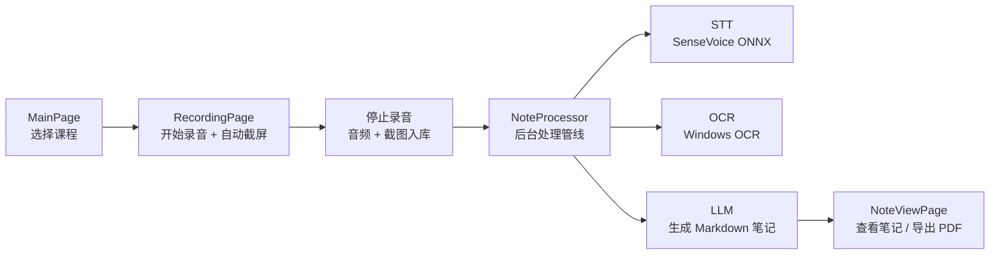

# ClassNote 单机版 — 开发文档

> 面向开发者的完整技术说明：架构、模块职责、关键实现细节、构建与测试。
> 适用代码版本：SenseVoice ONNX STT 替换完成后的单机版（无服务端）。

---

## 1. 总体架构

单机版为**单一 WPF 客户端应用**（`ClassNote.exe`），无任何服务端组件。
所有数据（会话、截图、笔记）保存在本机，STT / OCR 完全离线，仅 LLM 笔记生成需要联网。

### 1.1 分层结构

```
┌─────────────────────────────────────────────────────────────┐
│  UI 层（Views）                                             │
│  MainPage · RecordingPage · NoteViewPage                    │
│  SettingsWindow · RecordingSetupWindow                      │
│  （WPF XAML + Code-behind）                                 │
├─────────────────────────────────────────────────────────────┤
│  视图模型层（ViewModels）                                   │
│  MainViewModel · RecordingViewModel · NoteViewModel         │
│  BaseViewModel · RelayCommand                               │
├─────────────────────────────────────────────────────────────┤
│  服务层（Services）                                         │
│  AudioService · ScreenshotService · SenseVoiceSttService   │
│  WindowsOcrService · LlmService · PdfExportService          │
│  NoteProcessor · LocalRepository · AppSettings              │
│  ApiService / UploadService（保留原接口的门面）              │
├─────────────────────────────────────────────────────────────┤
│  数据层                                                     │
│  SQLite（classnote.db）· 本地文件（截图 / 录音 / settings）  │
└─────────────────────────────────────────────────────────────┘
```

### 1.2 核心流程



### 1.3 导航模型

`MainWindow` 是一个 `Frame` 容器，通过以下方法切换页面（`MainWindow.xaml.cs`）：

| 方法 | 页面 |
|------|------|
| `NavigateToMainPage()` | 会话列表 + 课程选择 |
| `NavigateToRecordingPage(sessionId, course, micName)` | 录音 + 截屏 |
| `NavigateToNoteViewPage(sessionId)` | 笔记查看 / PDF 导出 |

页面间通过事件（`StartRecordingRequested`、`SessionSelected`、`RecordingEnded`、`BackRequested`）回传切换。

---

## 2. 模块说明

### 2.1 录音 — `Services/AudioService.cs`

- 基于 NAudio `WaveInEvent`，固定 `WaveFormat(16000, 1)`（16kHz 单声道 PCM16）。
- 录音数据边写 `WaveFileWriter` 落盘，边触发 `AudioDataAvailable` 事件（供 UI 波形使用）。
- 输出 WAV 路径：`%LOCALAPPDATA%/ClassNote/audio/{sessionId}_audio.wav`。

### 2.2 自动截屏 — `Services/ScreenshotService.cs`

- 定时（默认 10s，检测到视频画面自动切 60s）全屏抓取。
- **pHash 变化检测**：对相邻帧计算感知哈希，按差异度分类：
  - `Annotation`（批注，差异 1%–8%）
  - `NewSlide`（新幻灯片，差异 ≥8%）
  - `Video`（视频，连续 3 帧差异 ≥40%）
- 后台线程池执行抓取 / 编码，通过 `SynchronizationContext` 封送回 UI 线程事件。

### 2.3 语音转文字（STT）— `Services/SenseVoiceSttService.cs` + `FbankExtractor.cs`

**这是本版本最重要的替换点**：由原名 `WhisperSttService`（Whisper.net / ggml-base.bin）替换为 **SenseVoice-Small ONNX**。

#### 模型与文件

| 文件 | 说明 | 大小 |
|------|------|------|
| `model_quant.onnx` | SenseVoice-Small INT8 量化模型 | ~240MB |
| `tokens.json` | CTC 词表（25055 个 token，含 <|withitn|> 等特殊标记） | ~350KB |
| `am.mvn` | CMVN 均值/方差（AddShift + Rescale） | ~11KB |

存放位置（`SenseVoiceSttService` 构造函数按优先级查找）：
1. `AppContext.BaseDirectory/models/sensevoice/`（随程序一起发布的模型）
2. `%LOCALAPPDATA%/ClassNote/models/sensevoice/`

#### 特征前端（FbankExtractor.cs）

与官方配置一致的参数：

| 参数 | 值 |
|------|-----|
| 采样率 | 16000 Hz |
| 窗函数 | Hamming（`0.54 - 0.46·cos(2πi/(N-1))`） |
| 预加重系数 | 0.97 |
| 去直流 | 每帧减均值 |
| FFT | 512 点 radix-2（400 采样帧，**FFT 前清零 400..511**，见下文注意点） |
| Mel 滤波器 | Slaney 式、80 维、20Hz ~ 8kHz、面积归一化 |
| 对数 | `log(energy)`（下限 `1e-10`） |
| 帧长 / 帧移 | 25ms / 10ms |
| LFR | m=7, n=6（拼接 7 帧，步进 6 帧），输出 560 维 |
| CMVN | 用 am.mvn 的 AddShift / Rescale 逐维归一化 |

#### 推理与解码

- onnxruntime CPU 会话，输入：`speech [1,T,560]`、`speech_lengths`、`language=0`、`textnorm=14`（withitn）。
- 输出：`ctc_logits [1,T,25055]`、`encoder_out_lens`。
- **CTC 贪心解码**：逐帧 argmax，跳过 blank（token 0）与重复 token。
- **分块推理**：`ChunkSeconds = 30`，每 30 秒音频一块（3000 帧），避免长音频内存峰值过高。
- 文本清理：去除 `<|withitn|>` / `<|woitn|>` 标记，合并分块结果。

> ⚠️ **开发注意**（历史 bug）：fbank 的 FFT 输入数组 `Complex[512]` 每帧必须 `Array.Clear` 补零，
> 否则 `400..511` 残留上一帧数据会导致 mel 能量异常（表现为识别结果为空）。

### 2.4 图片 OCR — `Services/WindowsOcrService.cs`

- 调用 `Windows.Media.Ocr`（Win10/11 内置），优先中文语言包，回退任意可用语言。
- 输入 JPEG 字节，输出按行拼接文本。无外部依赖。

### 2.5 LLM 笔记生成 — `Services/LlmService.cs`

- OpenAI 兼容 `/chat/completions` API，默认 DeepSeek（`https://api.deepseek.com`，模型 `deepseek-chat`）。
- 提供方法：
  - `GenerateNoteAsync`：系统提示为"资深助教"，输出 Markdown 笔记。
- 配置来自 `AppSettings`（用户在主页面「设置」窗口填写：API 基础地址 → API Key → 模型名称 → 备用 Key / 备用地址）。
- 支持备用配置故障切换。

### 2.6 处理管线 — `Services/NoteProcessor.cs`

`INoteProcessor.ProcessAsync(sessionId, audioPath, progress)` 串联全流程：

1. 更新会话状态为 `processing`。
2. **STT**：`_stt.TranscribeAsync(audioPath, progress)` → 转写文本（失败不阻塞，空文本继续）。
3. **OCR**：遍历该会话所有截图 → `_ocr.RecognizeAsync` → 写回 `ocr_text`，拼接文本。
4. **LLM**：`_llm.GenerateNoteAsync(course, transcript, ocrText)` → Markdown 笔记；
   失败时降级为 `BuildFallbackNote`（转写 + OCR 原文兜底）。
5. 保存笔记，更新会话状态为 `completed`。

### 2.7 数据存储 — `Services/LocalRepository.cs`

- SQLite 单文件数据库：`%LOCALAPPDATA%/ClassNote/classnote.db`。
- 单例 `LocalRepository.Instance`，自带建表（`CREATE TABLE IF NOT EXISTS`）。
- 表结构：

```sql
CREATE TABLE sessions (
  id TEXT PRIMARY KEY, course TEXT NOT NULL, title TEXT,
  start_time TEXT, end_time TEXT, duration INTEGER,
  status TEXT DEFAULT 'recording', audio_path TEXT, created_at TEXT);

CREATE TABLE screenshots (
  id TEXT PRIMARY KEY, session_id TEXT NOT NULL,
  seq_no INTEGER, timestamp REAL, type TEXT,
  image_path TEXT, ocr_text TEXT, created_at TEXT,
  UNIQUE(session_id, seq_no));

CREATE TABLE notes (
  id TEXT PRIMARY KEY, session_id TEXT UNIQUE,
  title TEXT, content_markdown TEXT, mindmap_data TEXT, -- mindmap_data 已废弃（见 2.5，保留列以兼容旧库）
  summary TEXT, key_points TEXT, created_at TEXT, updated_at TEXT);
```

- 写操作经由 `_writeLock` 串行化，读操作开新连接。

### 2.8 本地设置 — `Services/AppSettings.cs`

- 持久化到 `%LOCALAPPDATA%/ClassNote/settings.json`（JSON）。
- 字段：`LlmApiKey`、`LlmBaseUrl`（默认 DeepSeek）、`LlmModel`（默认 `deepseek-chat`）、
  `LlmVisionModel`、备用 `LlmFallbackApiKey` / `LlmFallbackBaseUrl`。
- `AppSettings.Instance` 单例，读多线程安全（快照克隆）。
- 设置窗口 `Views/SettingsWindow.xaml`：表单整体置于 `ScrollViewer` 中（窗口空间不足时可用鼠标滚轮上下滚动），
  字段顺序与 2.5 一致；「确定 / 取消」按钮独立于滚动区、固定在窗口底部，始终可见，确定后写回 `AppSettings`。

### 2.9 PDF 导出 — `Services/PdfExportService.cs`

- QuestPDF Community 许可，Markdig 渲染 Markdown → PDF。
- 静态构造函数注册中文字体（`ClassNoteCJK`：自动检测黑体 / 微软雅黑 / 宋体 / 楷体）。
- 输出路径：桌面（`SaveFileDialog` 或默认桌面目录），导出 `Note` 的 Markdown 正文。

### 2.10 兼容门面 — `Services/ApiService.cs` / `UploadService.cs` / `HttpClientProvider.cs`

- 保留原客户端 `IApiService` / `IUploadService` 接口签名（会话列表、笔记读取、文件落地），
  但实现全部改为**本地存储读写**，保证上层 ViewModel 无需感知数据来源变化。
- `HttpClientProvider` 提供共享 `HttpClient`（LLM 调用用）。

---

## 3. 视图模型说明

| 类 | 职责 | 关键成员 |
|----|------|---------|
| `MainViewModel` | 会话列表、课程选择、启动录音、刷新 | `RecentSessions`、`Courses`、`StartCommand`、`LoadSessionsAsync` |
| `RecordingViewModel` | 录音控制、进度、处理状态 | `Start/Stop`、`BackgroundProcessingTask`（停止后后台处理管线）、绑定 `NoteProcessor` |
| `NoteViewModel` | 加载并渲染 Markdown 笔记、导出 PDF | `Note`、`MarkdownHtml`、`LoadNoteAsync`、`ExportPdfToDesktopAsync` |
| `BaseViewModel` | `INotifyPropertyChanged` 基类 | `OnPropertyChanged` |
| `RelayCommand` | `ICommand` 实现 | 异步命令支持 |

> 安全说明：`NoteViewModel` 的 Markdown 渲染管线使用 `.DisableHtml()`，
> 防止笔记内容中的 raw HTML（潜在 script）注入执行。

---

## 4. 依赖清单（NuGet）

`ClassNote.csproj` 中的包引用：

| 包 | 版本 | 用途 |
|----|------|------|
| NAudio | 2.2.1 | 录音采集 / WAV 写入 |
| System.Data.SQLite.Core | 1.0.119 | SQLite 存储 |
| Newtonsoft.Json | 13.0.3 | JSON 序列化 |
| Markdig | 0.37.0 | Markdown → HTML |
| Microsoft.Web.WebView2 | 1.0.2903.40 | 笔记渲染视图 |
| **Microsoft.ML.OnnxRuntime** | **1.20.0** | **SenseVoice 推理（CPU）** |
| QuestPDF | 2024.12.0 | PDF 导出 |

> NuGet 源：项目自带 `ClassNote/NuGet.config`，`<clear/>` 后仅使用
> `https://nuget.azure.cn/v3/index.json`（国内镜像）。若从其他环境还原失败，可删除该文件回退官方源，或手动将 nupkg 放入全局缓存。

---

## 5. 构建

### 5.1 环境要求

- Windows 10 1809+ / Windows 11（x64）
- .NET SDK 8.0（`dotnet --list-sdks` 验证）
- Visual Studio 2022（可选，命令行亦可）

### 5.2 构建命令

```bash
cd ClassNote-Standalone/ClassNote
dotnet restore
dotnet build -c Release
```

- 产出：`bin/Release/net8.0-windows10.0.19041.0/ClassNote.exe`。
- `ClassNote.csproj` 已配置将 `Models/sensevoice/*` 复制到输出目录（`CopyToOutputDirectory=PreserveNewest`）。

### 5.3 发布（单文件 / 自包含可选）

```bash
# 依赖框架发布（目标机需安装 .NET 8 Desktop Runtime）
dotnet publish -c Release -r win-x64 --self-contained false -o publish/

# 自包含发布（目标机无需 .NET，体积更大）
dotnet publish -c Release -r win-x64 --self-contained true -o publish/
```

发布后需确认 `publish/models/sensevoice/` 三个模型文件齐全。

---

## 6. 测试

### 6.1 测试项目

`ClassNote.Tests/`（xUnit + Moq）位于解决方案根目录：

| 文件 | 覆盖内容 |
|------|---------|
| `Services/PdfExportServiceTests.cs` | PDF 导出（QuestPDF 渲染） |
| `ViewModels/MainViewModelTests.cs` | 会话列表、刷新、命令 |
| `ViewModels/NoteViewModelTests.cs` | 笔记加载 / Markdown 渲染 / PDF 导出命令 |
| `ViewModels/RecordingViewModelTests.cs` | 录音生命周期、管线条数 |
| `ViewModels/RelayCommandTests.cs` | RelayCommand 行为 |

### 6.2 运行测试

```bash
cd ClassNote-Standalone/ClassNote.Tests
dotnet test
```

> 说明：测试项目引用主项目（`ProjectReference`），需先 restore（测试项目同样使用 azure 镜像源）。

---

## 7. 常见开发问题

| 问题 | 原因 / 解决 |
|------|------------|
| restore 报 `unexpected EOF` | 网络波动镜像源不稳定；重试，或手动下载 nupkg 放入 `%USERPROFILE%/.nuget/packages`，或临时改用官方源 |
| 识别结果为空 | 排查 `FbankExtractor`：确认 FFT 补零、CMVN 读取（am.mvn 的 AddShift/Rescale）、LFR 参数 m7n6 |
| 内存峰值高 | 长音频分块（30s），若仍需优化可调低 `ChunkSeconds` |
| Debug 输出目录含 Whisper 旧文件 | `bin\Debug` 为历史残留，不影响 Release 构建；可删除 bin/obj 后重新构建 |

---

## 8. 历史文档归档

`docs/archive/superpowers/` 存放的是**旧服务端架构**（FastAPI + PostgreSQL + Celery + GPU）时期的设计与实施文档，
与当前单机版架构**不兼容**，仅供追溯历史决策参考，**请勿按这些文档开发**。

当前唯一有效的文档：

- [根 README](../../README.md) — 项目总览
- [开发文档](开发文档.md) — 本文档
- [部署文档](部署文档.md) — 部署与发布
