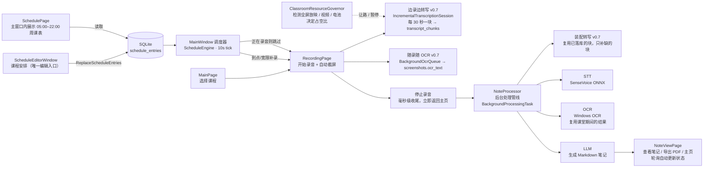

# ClassNote 单机版 — 开发文档

> 面向开发者的完整技术说明：架构、模块职责、关键实现细节、构建与测试。
> 适用代码版本：v1.0.2（单机版 · 无服务端 · 含笔记分段生成、多声音来源录音、定时记录/每周课表、可选内网 PaddleOCR 服务、触摸屏支持）。
>
> **版本号维护（易漏点）**：产品版本号是**手写常量**，不随 git 自动推导，发布前需同步 3 处：
> `ClassNote/ClassNote.csproj`（`Version`/`FileVersion`/`AssemblyVersion`，决定 exe 文件版本）、
> `installer/ClassNote.iss`（`MyAppVersion`，决定安装包版本与 `dist/ClassNote-<版本>-setup-x64.exe` 文件名）、
> `build-installer.bat` 末尾提示的输出文件名（仅提示文案）。
>
> **版本变更（近期）**：
> - **v0.4.1**：①「添加课表条目」课程名不再显示为空白（可编辑 ComboBox 模板缺 `PART_EditableTextBox`）；
>   ②每日课表相邻两课不再重叠（课块高度算而未用 + 固定 18px 下限）；③定时记录改为后台静默启动（到点不再弹出主界面）。
> - **v0.4.2**：课程名改为**纯下拉选择**（不支持手输，避免"数学 "与"数学"这类同课不同名）；渲染校验工具
>   修正窗口内容根 Margin 造成的横向拉伸/箭头被挤出可视区的假象。
> - **v0.5.0**：①设置窗口拆成**「API 配置」/「录音设置」两个页签**；②录音新增**声音来源（麦克风 / 系统声音 /
>   混合）与设备选择**（新增 `AudioSourceKind` / `RecordingConfig` / `AudioPcmConverter`，`AudioService`
>   重写为多路采集 + 内存混音）；③「模型名称」由手输改为**可编辑下拉，填好地址 + Key 后自动拉取
>   `/v1/models`**；④**删除备用 API Key / 备用 API 基础地址**及故障切换逻辑；⑤`devtools/AudioProbe`
>   真机录音冒烟工具；⑥渲染工具修 `Application.ShutdownMode` 导致的"多窗口渲染全空白"。
> - **v0.5.0 · 主页改版**：①顶部三个图标按钮（刷新 / 定时课表 / 设置）改为**文字按钮**并新增「开始记录」；
>   ②**移除左侧「选择课程」模块**，主页改为整宽单栏（课程在「开始记录」弹窗内确认）；③「最近记录」新增
>   **科目筛选**（默认「全部课程」，全选/批量导出/批量删除只作用于筛选出的记录）；④行时间戳加**星期几**，
>   并新增**单条记录右键菜单**（查看笔记 / 导出 PDF / 删除）；⑤修 `Button` 实际宽度小于 `DesiredSize`
>   导致的**中文按钮文案被截断**、以及 `全选` 复选框**盖住**左侧提示文字。
> - **v0.6.0**：①笔记提示词重写——只保留**课程标题 / 核心知识点 / 重点及易错点**三部分，
>   要求核心知识点（解题模板、解题技巧、公式定理、定义）**照抄原文、不得改写概括**，删除例题与解析、
>   师生问答；②新增**笔记分段生成**（`NoteSegmenter` + `NotePromptBuilder` + `LlmService` 编排），
>   取代原先"超长素材直接 `Truncate` 截断"的做法；③修三处缺陷（合并被轮次上限打断会丢分段、
>   `"{}"` 被当成笔记内容、OCR 页码跨条目污染）；④新增 `NoteSegmenterTests` / `NotePromptBuilderTests`。
> - **v0.6.0 · 录音来源**：①声音来源固定三种并改名——**仅麦克风 / 仅系统声音 / 麦克风和系统声音**；
>   ②**来源路由优化**：单路来源改为采集回调**直写落盘**（不再过合成器与合成线程），
>   系统默认播放设备按**娱乐 → 控制台 → 通信**逐角色回退（避免回环取错端点录成静音），
>   指定播放设备失效时明确提示"已回退"；③「麦克风和系统声音」现在也能在开始记录弹窗里选定播放设备
>   （旧实现会丢弃该选择、回环只能落到系统默认设备）。
> - **v0.6.0 · 结构化条目合并**：①分段调用改为产出**条目列表**
>   （`{"items":[{title,body,kind,source}]}`），为后端确定性处理提供结构；②**确定性去重**——
>   仅合并「标题 + 正文 + 归类」完全一致的条目，不做相似度合并（避免静默丢内容），
>   合并条数如实上报；③最终一遍由模型做**全局逻辑排序 + 连贯性润色**，输出 `index/transition/body`；
>   ④**逐条回校**（`NoteItemVerifier`：头/中/尾三探针 + 条数一致性）拦截"删条、揉条、改写正文"，
>   任一条不过就整体退回按原条目拼装并留痕；⑤模型不认 schema 时自动退回旧的 Markdown 合并路径。
> - **v0.6.0 · 分轨录音与来源标注**：①「麦克风和系统声音」改为**分轨录制**——麦克风与系统声音
>   各写一个文件（`{sessionId}_mic.wav` / `{sessionId}_system.wav`），**不再合成一路**；
>   ②**逐路分别转写**，转写结果按 `【麦克风（教室现场）】`/`【系统声音（课件/网课播放）】`分区标注后交给 LLM，
>   使模型能分辨"老师现场讲的"与"课件/网课里播的"（合并阶段另有"不许洗掉来源标记"的要求）；
>   ③多来源转写**不按整体字符切段**，各来源按同一套窗口均摊，保证每段都带两侧标注；
>   ④代价：STT 调用次数等于路数（耗时约 2×，刻意不做并行以免与截图 OCR 抢 CPU）；
>   ⑤`Pcm16Mixer` / `ActiveRecorder` 保留但成为非产品路径。
> - **v1.0.0（首个正式版）**：整合 v0.4.0 ～ v0.6.0 的全部能力，并纳入 v0.7 阶段**已实测完成**的提速与修复——
>   边录边转写（`IncrementalTranscription` / `TranscriptChunkStore` / `TranscriptAssembler`）、
>   课堂资源让路（`ClassroomResourceGovernor`，STT 固定半核 + 全屏/视频/电池自动降速）、
>   模型常驻单例与闲置释放（`ModelIdleReleaser`）、公式渲染统一（`NoteHtmlRenderer`）、
>   PDF 导出修复、录音计时改用墙钟、科目筛选修复、停录不再阻塞、转写与 OCR 并行、LLM 连接复用。
>   单元测试 **358 项全部通过**。产品版本号三处（`ClassNote.csproj` / `installer/ClassNote.iss` /
>   `build-installer.bat`）同步为 **1.0.0**；v0.7 中 `P1-1`、`P1-3`～`P1-5`、`P2-2`、`P2-3` **仍未实施**，
>   见 [笔记生成提速方案](笔记生成提速方案-v0.7.md)。
> - **v1.0.1 · 截图 OCR 引擎可选 + OCR 文本降噪**：①设置新增**「OCR 识别」页签**（窗口由两页签变三页签）——
>   内置 Windows OCR（默认，离线）与**内网自建 PaddleOCR 服务**二选一，含地址 / 请求方式 / 访问密钥 /
>   超时 / 失败回退，以及"测试识别"（真图实跑，报字数与耗时）。新增 `OcrEngineConfig` / `PaddleOcrService`
>   （`PaddleOcrResponseParser` 纯函数解析）/ `OcrServiceFactory`（含 `FallbackOcrService` 与**2 分钟冷却**）；
>   ②支持两代官方协议：hubserving `/predict/ocr_system`（`{"images":[base64]}`）与 PaddleX `/ocr`
>   （`{"file":base64,"fileType":1,"visualize":false}`），响应兼容 `results[].text` / `prunedResult.rec_texts` /
>   `txts[]` 等形态并**按文字框坐标还原阅读顺序**；③新增 `OcrTextNormalizer`（纯函数，在 `NoteProcessor`
>   装配 OCR 素材时执行，库里仍存原始 OCR）：合并逐字空格、公式行全角转半角并紧排运算符、`m 主 n`→`min`、
>   公式行里被认成「一」的减号还原为 `-`，**绝不合并 `1 7 3 5 9 4 8` 这类数字序列**；真实记录实测
>   OCR 素材 18735 → 12068 字（−35.6%）；④提示词补 `OcrNoiseRules` / `OcrSourceRules`：残余噪声
>   「确定不了就原样保留并标注**OCR 不清**，禁止猜符号」，OCR 条目 `source` 一律填「课件」；
>   ⑤`RecordingViewModel` 的 OCR 队列与 `NoteProcessor` **共用同一个 OCR 实例**（冷却与计数才有意义）。
>   单元测试 **422 项全部通过**；产品版本号三处同步为 **1.0.1**。
>   部署与设置见 [OCR 服务设置与部署](OCR-服务设置与部署.md)。
> - **v1.0.2 · 一体机（Win10 触摸屏）现场问题修复**：用户现场为海康威视一体机（Windows 10 + 触摸屏 +
>   无鼠标），报告 5 项问题，逐条定位与修复（完整根因报告见
>   [现场问题根因报告](../TestResults/reports/现场问题根因报告-20260916.md)）——
>   ①**点历史记录崩溃**：时间戳列为显示"周几"改成 `TextBlock + <Run>` 后，命中测试把行内元素 `Run`
>   当作 `e.OriginalSource`；`Run` 是 `FrameworkContentElement`**不是 Visual**，
>   `VisualTreeHelper.GetParent` 对它直接抛「System.Windows.Documents.Run 不是 Visual 或 Visual3D」，
>   又被 `App` 的全局异常兜底吞掉（`Handled = true`），用户只看到报错框、页面毫无反应。
>   新增 `Controls/VisualTreeWalk`（按 Visual / Visual3D / ContentElement 分派到各自的父级查询 API，
>   **永不抛异常**）并让 `MainPage.FindVisualParent` 改用它；`Controls/SmoothScroll` 早就写对了这个分派，
>   这一处漏了。②**结束录音卡死数秒**：`IncrementalTranscriptionSession.Dispose()` 对**每一路**音轨
>   `worker.WaitForCompletion(2000)`，而它是从 UI 线程（`RecordingPage.Page_Unloaded` →
>   `RecordingViewModel.Dispose`）调用的——单路 2 秒、双路（默认配置）**实测 4.01 秒**界面完全无响应，
>   且这是"固定等满上界"而非"最多等到干完"；期间 UI 线程上**所有 `DispatcherTimer` 一并停摆**
>   （`MainWindow` 课表调度器与 `RecordingPage` 的"到点自动下课"看门狗），超过 5 秒 Windows 直接给窗口
>   挂"未响应"。修复：`Dispose` 只做标记 + `SignalInputComplete()`，立即返回（尾部补算本就由课后管线
>   在后台线程等，`NoteProcessor` 里已有 `WaitForCompletion(120s)`），并把页面卸载时的重释放
>   （含音频设备 `Dispose` 的 Join）整体移交后台线程；`DispatcherTimer` 必须在自己的线程上停，故
>   `RecordingViewModel` 拆出 `StopElapsedTimer()` 供 UI 线程先调用。实测 **4012ms → 0ms**。
>   ③**跨课错记（语文记到物理上、物理记录丢失）**：课表允许一节接一节，但下一节到点时若上一节仍在
>   录音，原实现只做**整节跳过**且写进 `ScheduleEngine` 的"当天已触发"记忆 → 这一节当天再也不会被录，
>   其内容全录进上一条仍标着旧课程名的会话。修复：`MainWindow` 先经 `RecordingPage.RequestStopAsync()`
>   结束上一节（与"结束录音"按钮、自动下课看门狗**同一条收尾路径**）再开始本节，停不下来才放弃本次
>   并留给下一个 10 秒调度周期重试；决定逻辑抽为纯函数 `Services/ScheduledRecordingHandoff`。
>   ④**触摸屏长按 = 右键**：全仓此前**0 处**触摸/触笔代码，而 WPF 在 Windows 10 桌面模式下不会把
>   "按住不放"翻译成鼠标右键（系统的"按住以右键单击"只在平板模式外壳里生效）→ 无鼠标的机器上
>   **无法唤出**查看笔记 / 导出 PDF / 删除。新增 `Controls/TouchLongPress` 附加行为：按下后 550ms 内
>   未抬起且位移 < 14px 即就地打开该元素的 `ContextMenu`；只认触摸/触笔（不干扰真鼠标右键）、
>   移动即取消（不影响滚动）、不吞事件、Touch 与 Stylus 双路径自动去重。
>   ⑤**触控体验**：`ListView` 开启 `ScrollViewer.PanningMode`（此前默认 `None`，手指**拖不动**列表，
>   只能去够滚动条）、滚动条 9px→16px、右键菜单项 34px→44px、列表行高 46→52；新增设置项
>   「触摸屏优化」（`AppSettings.TouchOptimizations`，默认开，可在设置窗口关闭）。
>   另新增 `Services/UiWatchdog`：UI 线程 500ms 心跳，任一次间隔 ≥2 秒即把"卡了多久 + 当时阶段"
>   追加写进 `classnote-crash.log`，让"卡死"这类无日志问题下次能直接取证（**卡顿期间无法执行任何代码，
>   故记录的是时长与结束时刻，这是原理限制**）。新增复现器 `devtools/BugRepro`
>   （`history-run` / `context-menu` / `schedule-handoff` / `ui-block`，退出码 2 = 复现）。
>   单元测试 **422 → 435 项全部通过**；产品版本号三处同步为 **1.0.2**。

---

## 1. 总体架构

单机版为**单一 WPF 客户端应用**（`ClassNote.exe`），无任何服务端组件。
所有数据（会话、截图、笔记）保存在本机，STT / OCR 完全离线，仅 LLM 笔记生成需要联网。

### 1.1 分层结构

```
┌─────────────────────────────────────────────────────────────┐
│  UI 层（Views / Controls）                                 │
│  MainPage · RecordingPage · NoteViewPage                    │
│  SettingsWindow · RecordingSetupWindow                      │
│  SchedulePage（定时课表展示页）· ScheduleEditorWindow         │
│  （课程安排编辑）· ScheduleEntryDialog                        │
│  Controls/SmoothScroll（全局平滑滚轮）                       │
├─────────────────────────────────────────────────────────────┤
│  视图模型层（ViewModels）                                   │
│  MainViewModel · RecordingViewModel · NoteViewModel         │
│  BaseViewModel · RelayCommand                               │
├─────────────────────────────────────────────────────────────┤
│  服务层（Services）                                         │
│  AudioService · AudioConfig(RecordingConfig/AudioSourceKind) │
│  AudioPcmConverter · ScreenshotService · SenseVoiceSttService│
│  WindowsOcrService · LlmService · PdfExportService          │
│  NoteSegmenter（笔记素材分段）· NotePromptBuilder（提示词）  │
│  NoteProcessor · LocalRepository · AppSettings              │
│  ScheduleEngine（课表→定时判定）· StartupRegistrar（开机自启）│
│  ApiService / UploadService（保留原接口的门面）              │
│  —— v0.7 边录边转写 ——                                  │
│  TranscriptionChunking（分块数学）· PcmBlockBuffer（攒块）  │
│  IncrementalTranscription（课堂会话 + 工作线程）· WavePcm   │
│  TranscriptAssembler（增量装配）· BackgroundOcrQueue        │
│  ClassroomResourceGovernor（给放映 / 视频让路）             │
├─────────────────────────────────────────────────────────────┤
│  数据层                                                     │
│  SQLite（classnote.db：sessions/screenshots/notes/          │
│   schedule_entries/transcript_chunks）· 本地文件（录音）    │
│   （v0.7 转写块：transcript_chunks 表）                     │
└─────────────────────────────────────────────────────────────┘
```

### 1.2 核心流程



> **v0.7 的关键变化**：转写与 OCR 不再是"下课以后才开始的串行两段"，而是在录音期间
> （机器本来就有空闲的那段时间）就按块推进并落库；下课时处理管线只补最后不足一块的部分。
> 课堂期间 `ClassroomResourceGovernor` 按 2 秒周期评估外部负载，检测到全屏放映 / 视频播放 / 电池供电
> 时按占空比降速，关闭档或手动暂停则完全停下——**慢一点，但绝不与正在放的内容抢机器**。
> 取舍与实测数据见 [`TestResults/bench/v0.7-提速实测报告.md`](../TestResults/bench/v0.7-提速实测报告.md)。

> 定时记录是另一条独立的“无人值守”触发链路：**不需要**经过手动“开始记录”弹窗，
> 由 `MainWindow` 内常驻的 `DispatcherTimer` 每 10 秒驱动 `ScheduleEngine` 评估课表，
> 到点自动 `CreateSessionAsync` 并导航至 `RecordingPage`（带 `autoStopAt` 下课自动结束）。

### 1.3.1 UI 设计体系（v0.2 UI 重设计）

整体视觉主题为「云白 + 靛蓝」的现代轻量风格，全部样式集中在 **`App.xaml`** 应用级资源中，
各视图只写业务结构，不重复定义外观：

| 资源 | 说明 |
|------|------|
| 品牌色 | 主色 `#4C6FFF`（靛蓝），渐变按钮 `#5B8CFF → #3A57E8`，危险色 `#E5484D` |
| 背景 / 卡片 | 页面背景 `#F2F3F7`，白色圆角卡片（CornerRadius 14，细边框，无投影保证文字锐利） |
| 字体 | `Segoe UI, Microsoft YaHei UI, Microsoft YaHei` 复合字体族 |
| 按钮 | `PrimaryButtonStyle`（渐变主按钮）/ `DangerButtonStyle` / `GhostButtonStyle` / `PrimaryGhostButtonStyle`（浅蓝底 + 主色描边，次级主操作，用于「批量导出 PDF」）/ `DangerGhostButtonStyle`（危险色描边幽灵按钮）/ `IconButtonStyle`，带悬停高亮与按下微缩动画 |
| 提示气泡 | 全局 `ToolTip` 样式：**白底黑字**（`#FFFFFF` 底 / `#1F2329` 字 / 浅灰 1px 细边框），统一应用于所有按钮与控件的悬停提示 |
| 输入控件 | 圆角 TextBox（聚焦出现品牌色光晕）、自定义 ComboBox 模板（圆角 + 下拉浮层圆角阴影） |
| 列表 | 卡片式 ListView/ListBox 行模板（悬停/选中高亮、选中竖条、状态胶囊），细条滚动条 |
| 动画 | 页面载入淡入 + 上移（0.26s CubicEase）、录音红点呼吸 + 扩散光环、按钮悬停/按下过渡、全局滚轮平滑滚动（380ms QuadraticEase，步长按视口 1/2 自适应） |

各页面对应关系：

- **MainPage（v0.5.0 单栏改版）**：顶部品牌栏（logo + LLM 状态胶囊 + **文字按钮**：开始记录 / 刷新列表 / 定时记录 / 设置）→ 下方**整宽**「最近记录」卡片；卡片内两行工具区：第一行「最近记录 + 操作提示 / 全选（三态）/ 已选 N 项 / 批量导出 PDF / 删除」，第二行「科目筛选下拉框（默认「全部课程」，含内置 9 门 + 库中出现过的自定义课程名）/ 共 N 条 / 已按科目筛选」；列表行 = 勾选框 / 课程徽章 / 标题 / **时间戳（yyyy-MM-dd HH:mm + 周X）** / 状态色点胶囊。
  - **左侧「选择课程」模块已移除**：课程改在「开始记录」弹窗（`RecordingSetupWindow`）里确认，主页不再占用一栏宽度；`MainViewModel.SelectedCourse` 仍保留为"上次使用的课程"，用于回填弹窗默认项。
  - **筛选与排序**：默认「全部课程」+ 按时间倒序（本地库按 `created_at DESC` 返回，列表保持该顺序）；筛选只影响可见集合，全选/批量导出/批量删除均**只作用于筛选出的记录**，被筛掉的记录不会被误删；切换筛选条件时勾选状态保留（同一批 `Session` 实例被复用）。
  - **单条记录右键菜单**（右键或 Shift+F10 唤出，方向键选择，Enter 执行）：查看笔记 / 导出 PDF / 删除。`ContextMenu` 是 Popup、**不参与视觉树继承**，靠 `DataContext` 继承拿不到被右键的那一行（菜单项会是 `null`，右键操作静默失效）；因此由 `SessionList_ContextMenuOpening` 在弹出前用 `ItemsControl.ContainerFromElement` 定位命中的行并写入菜单 `DataContext`（右键与 Shift+F10 两种入口都会先触发该事件）。解析逻辑抽成 `public static AttachSessionToContextMenu` 以便 `RenderHarness` 回归这条路径。
  - **文字按钮必须给 `MinWidth`**：WPF 分配给 `Button` 的宽度可能小于它的 `DesiredSize`，中文文案会被左右截断且不报错；顶部与批量操作按钮均按文案给出 `MinWidth`（`RenderHarness` 的 `clipped-buttons` 断言会拦住回归）。
- **RecordingPage**：录音仪表盘（呼吸红点 + 光环、等宽大计时器、截图计数胶囊、自动截屏提示、保存进度细条、麦克风下拉、红色结束按钮），右上角角标显示课程名 + **声音来源**（v0.5.0）；**定时触发的录音**会额外显示「定时记录 · HH:mm 自动结束」黄色角标，到点自动走与手动「结束录音」相同的收尾路径。v0.5.0 起：**仅当来源包含麦克风时**才显示麦克风下拉，纯系统声音来源改为显示「正在录制系统声音」说明（避免误以为没在录）。
- **NoteViewPage**：白色工具栏（返回 / 导出 PDF / 删除，均带图标与 ToolTip）+ 沉浸式 WebView2 笔记区。
- **SettingsWindow / RecordingSetupWindow**：统一圆角输入控件与底部固定按钮区。设置窗口为**两个页签**（v0.5.0）：
  - **「API 配置」**：API 基础地址 / API Key / **模型名称（可编辑下拉，填好地址 + Key 后自动拉取 `/v1/models`）** / 请求超时 / 测试连接；
  - **「录音设置」**：声音来源（麦克风 / 系统声音 / 混合）+ 对应设备（麦克风或播放设备）；按来源动态显隐对应设备选择器，并说明定时记录会用到哪套来源/设备。
  - `RecordingSetupWindow`（「开始记录」弹窗）也带来源选择：来源 = 系统声音时设备下拉切到播放设备；来源 = 混合时设备下拉列麦克风，系统声音走设置里的默认播放设备。
- **SchedulePage（v0.4.0 页式课表）**：主窗口 Frame 内独立的「定时记录 · 每周课表」页面（不是独立窗口）。顶部：返回 / 总开关（开启定时记录，即时生效）/ 开机自启（写入注册表，被系统策略拦截时弹窗提示）/「课程安排」编辑按钮；主体为 **时间轴锁定 05:00–22:00** 的周一至周日只读网格（每天一列 = 当天课表；课程块停用条目半透明；**点击课程块任意位置**直接进入该条目的「编辑课表条目」并即时保存）；课块几何由 `Views/ScheduleGridLayout` 统一计算——**高度按真实时长等比**、相邻课块间强制留间隙（相邻 10 分钟短课也不重叠），块高不足时标签降级为单行/省略号；时间轴外课程（早于 05:00 / 晚于 22:00）定时触发照常，仅不在锁定轴上显示并在概览条注明；批量新增/整体核对统一走「课程安排」。
- **ScheduleEditorWindow（v0.4.0 课程安排）**：课表整体编辑入口（如添加新课程、批量核对）：列表式维护全部条目（星期 → 时间排序），行内编辑 / 停用启用 / 删除，「添加课程」走 `ScheduleEntryDialog`；「保存课表」整体写回 `schedule_entries`（取消全部丢弃）。
- **ScheduleEntryDialog（v0.4.0 单条编辑）**：课程（**下拉选择，不支持手输**——候选 = 内置 9 门 + 已录入过的课程名；编辑时课程名回显为选中项；历史自定义课程名会临时补进候选后再选中）/ 星期 / 时间段 / 备注 / 启停；校验课程已选择、时间合法、同一天时间不重叠。课表视图**点击课程块**与「课程安排」行内「编辑」均复用本对话框。
  - ⚠️ 课程下拉框用**非可编辑** ComboBox（`IsEditable=False`），选中项由模板里的 `ContentSite` 展示。`App.xaml` 的 ComboBox 模板同时保留了名为 `PART_EditableTextBox` 的文本宿主（并在 `IsEditable=True` 时置为 Visible、把 `ContentSite` 置为 Hidden）——WPF 只认这个命名部件承载可编辑文本，缺失时**可编辑**下拉框会渲染成空白（v0.4.1 修的正是这个坑）；非可编辑下拉框不经该部件，不受影响。
  - 保存时以 `SelectedItem` 为准（不读手输文本），未选择时提示「请选择课程名称。」。

> 界面交互接口（ViewModel 属性、事件、`x:Name`、转换器）在重设计过程中保持完全不变，
> 仅 `RecordingPage.xaml.cs` 的指示器闪烁由「红↔透明」改为「透明度呼吸」这一处纯视觉代码调整。

### 1.3.2 开发期 UI 验证工具（devtools/）

`devtools/` 下为不入库外部的辅助工程（本机验证用，不影响主程序构建）：

- `RenderHarness`：进程内实例化各视图并离屏渲染为 PNG，用于无头视觉检查。
  - 每次运行会输出 `[content]` 行报告各渲染图的有效内容占比（ink%），用于区分"真实渲染"与无头环境下的透明空图；
  - 关键 `[check]` 断言：`week-entry-blocks`（课块数 = 条目数）、`week-entry-overlaps`（同列课块重叠数，须为 0）、`add-dialog-course-isEditable`（课程框须为 False：只能选择）、`add-dialog-course-displayed` / `edit-dialog-course-displayed`（下拉框真正渲染出来的课程名）、`add-dialog-combo-arrows-visible`（下拉箭头须完整落在框内，否则用户看不到"可点开选择"的提示）；
  - ⚠️ 窗口类视图（对话框/编辑窗）走 `RenderWindowContentRoot`：**必须先扣掉内容根的 `Margin` 再 Measure/Arrange**。历史写法直接把内容根设成窗口尺寸，相当于多给 52×42 的宽高，右侧控件（下拉箭头）会被挤出可视区、整页被横向拉伸（真实窗口里一切正常）；
  - ⚠️ **`Application.ShutdownMode` 必须显式改为 `OnExplicitShutdown`**（v0.5.0 修）：默认 `OnLastWindowClose` 下，渲染完第一个窗口并 `Close()` 后整个 `Application` 就关闭了，此后 `Show()` 出来的窗口 `IsVisible=False`、`ActualWidth=0`，渲染成全透明空图（表现为"设置窗口截图全空"，与窗口本身无关）。需要多状态截图时也可以改用「直接 Measure/Arrange 页面再 `RenderToPng`」（`RenderPageDirect`）；
  - ⚠️ 需要按状态多次渲染**同一个窗口**时不能复用实例（`Close()` 之后无法再 `Show()`）：每次新建实例，并用 `RenderHostWindow(..., postShow: SelectTab(n))` 在 `Show()` 之后切换页签；
  - v0.5.0 新增断言：`recording-source-label` / `recording-system-notice` / `recording-mic-combo-visible-when-system-only`（仅系统声音来源时录音页不显示麦克风下拉、但显示录制说明）、`setup-device-combo-items`（配置窗口设备下拉必须真的选中一项，否则渲染为空白）；
  - v0.5.0 新增主页断言：`toolbar-button-*`（四个文字按钮存在）、`course-selection-listbox-removed`（左侧课程选择模块已移除，按 `ItemsSource` 内容判定而非控件类型——`ListView` 继承自 `ListBox`）、`filter-combo` / `filter-default-is-all-courses` / `filter-has-builtin-courses`（科目筛选）、`clipped-buttons`（**任何**文字按钮都没被截断）、`rows` / `withContextMenu` / `menuHasDeleteAndExport` / `menu-resolved-session`（右键菜单能定位到被右键的记录）、`row-timestamp-date-time` + `has-weekday`（时间戳含日期时间与星期几）、`filter-empty-state`（筛选无结果时文案为「当前科目下暂无记录…」）；
  - 有效截图已归档到 **`docs/ui-renders/`**：主页三种状态 `main-page.png`（全部课程）/ `main-page-filtered.png`（按科目筛选）/ `main-page-filter-empty.png`（筛选无结果空状态）；`recording-page.png` / `recording-page-system.png`（系统声音来源）/ `recording-setup.png`；`settings-api.png` / `settings-recording.png`（设置页签；v1.0.1 起还会渲染 `m4c-settings-ocr.png` 内置引擎态与 `m4d-settings-ocr-remote.png` 内网服务态）；`schedule-week.png` / `schedule-editor.png` / `entry-dialog-add.png` / `entry-dialog-edit.png`。UI 迭代后可重新渲染覆盖，便于人工快速比对布局。
- `ScheduleAutoStartProbe`：**定时记录后台静默启动端到端探针**。进程内跑真实启动链路（`App` 资源 + `MainWindow` + 10s 调度器 + `ScheduleEngine`），写入一条"下一分钟到点"的临时课表条目触发自动录音，全程断言：
  - 主窗口**从未可见**（`MainWindow.IsVisible` + `EnumWindows/IsWindowVisible` 枚举进程内可见顶层窗口）；
  - 隐藏在后台的录音页确实 `Loaded` 并进入"录音中"（`MainWindow.IsRecordingActive`）。
  - 用法：`dotnet run --project devtools/ScheduleAutoStartProbe -c Release`（`--legacy-startup` 复现修复前的"到点弹窗"行为；`--cleanup` 清理历史遗留测试数据）。
  - ⚠️ 会临时改写 `settings.json`（毫秒级后立即还原）与课表条目（结束后还原），并创建 1 个测试会话（结束后连同文件删除）；请在启用定时记录前运行。
- `CaptureTool`：启动真实应用、模拟点击并 PrintWindow 截图（真实输入注入 + 图像扫描定位按钮）。
- `VisualCheck`：对截图做 Windows OCR 文本抽查与关键区域像素采样。
- `AudioProbe`（v0.5.0 引入，v0.6.0 扩充）：**真机录音冒烟验证**。按来源各录 N 秒，再解析产物 WAV
  校验格式（16kHz / 单声道 / PCM16）、时长（与录音秒数误差 < 0.3s）与峰值信号，输出
  `AUDIO_PROBE_OK` / `AUDIO_PROBE_FAILURES=n`（退出码同步）。四个用例分别覆盖两条采集路径与显式设备路由：
  | 用例 | 覆盖 |
  |------|------|
  | `mic` | 仅麦克风 → 单路直写路径 |
  | `system-default` | 仅系统声音（未指定设备）→ 单路直写 + 默认播放设备**角色回退** |
  | `mic-and-system`（分轨） | 麦克风和系统声音 → `StartRecordingDual`，**两个文件**各自良构 |
  | `mic-and-system-explicit-out`（分轨） | 显式指定播放设备 → 回归"选定的播放设备曾被丢弃"这一缺陷 |
  > 「麦克风和系统声音」的两个用例走 `StartRecordingDual` 而非合成路径：产品上这两路是**分轨**录制的，
  > 用合成路径做冒烟会测到一条产品已不使用的分支。分轨用例逐路判定信号：
  > 麦克风那一路静音算失败（`--silent-ok` 也不放过），系统声音那一路空闲时 0 秒属正常。
  用法：`dotnet run --project devtools/AudioProbe -c Release -- <输出目录> <每种来源秒数> [--silent-ok] [--all-devices]`。
  - `--silent-ok`：允许 peak=0（安静机器上回环本来就没声音）；不加时 peak=0 判失败并提示
    "该来源完全没有信号，回环用例通常是选错了播放设备"；
  - `--all-devices`：对**每个**播放设备各跑一次「仅系统声音」，用来定位"到底哪个设备在出声"，
    这是回环录成静音时最直接的排查手段（旧版只有默认设备一个用例，查不到这一点）。
  > peak=0 不是回环的失败：没有声音在播放时回环本来就只有静音，所以该用例的信号校验可用
  > `--silent-ok` 放宽。
- `NoteBench`（v0.7 引入）：**笔记链路实测与"增量 = 批量"对拍**。它回答两个必须用真实模型回答、
  单测回答不了的问题：转写文本有没有变、各阶段真实耗时是多少。四个子命令：

  | 命令 | 作用 |
  |---|---|
  | `chunks <wav>` | 只看分块计划（块数 / 末块帧数 / 格式判定），**不需要模型** |
  | `stt <wav> [--threads N]` | 冷加载 + 温转写 + 推导模型加载耗时 + **实时因子 RTF**；`--threads` 用来量化"留一半核"的代价 |
  | `identity <wav> [--slices a,b,c] [--pause-at x]` | **逐块 + 整体对拍**：整文件路径（公开入口与逐块入口）vs 边录边转写路径（生产 `PcmBlockBuffer`）；`--slices` 模拟采集回调的不齐分片，`--pause-at` 在指定进度处暂停一次并恢复，验证重对齐后仍然一致 |
  | `classroom <wav> [--threads N] [--mode auto]` | **按真实时间 1× 喂 20ms 帧**，走生产代码（增量会话 + 资源调度器 + 工作线程 + 真实 SQLite 临时库 + 装配器），输出课堂期间的平均整机 CPU 占用、已落库块数、**课后残余等待**，并与整文件结果对拍 |

  - **退出码 0 = 逐字相同，非 0 = 存在差异**（并打印差异定位），可直接接进 CI。
  - 依赖 `InternalsVisibleTo("NoteBench")`：对拍必须驱动生产代码里**同一个**块推理入口，
    为此放开 internal 可见性，而不是把内部接缝提升为公开 API。
  - 实测数据与口径见 [`TestResults/bench/v0.7-提速实测报告.md`](../TestResults/bench/v0.7-提速实测报告.md)；
    典型结论：95.61 秒素材 4 块逐块无差异；留一半核只慢 6.7%；课堂期间平均占整机 5.4%。
  - 用法：`dotnet run --project devtools/NoteBench -c Release -- identity <wav>`。
- `NoteRender`（v0.7 引入）：**笔记渲染校验**。把笔记 HTML 真正放进 **WebView2 + 离线 MathJax** 跑一遍，
  用 DOM 断言 + 截图回答"用户到底看到了什么"。
  - 为什么单测与 `RenderHarness` 都不够：单测只到"Markdown → HTML"，而公式事故恰恰发生在最后一步
    （HTML 没错、**MathJax 分隔符配错**）；`RenderHarness` 为了稳定出图是**刻意隐藏 WebView2** 的，抓不到正文。
  - 子命令：`--demo`（裸括号 + `$行内$` + `$$行间$$` 三种样例）、`--md <文件>`、`--session <id前缀>`（只读渲染库里的真实笔记）、
    `--legacy-config`（**故意用事故当时的分隔符复现问题**，用于前后对比）。
  - 断言：裸方括号写法必须完整留在正文里（事故时会被拆成 `d ⏎ i ⏎ j`）、
    每个公式节点都必须被 MathJax 排出结果。**退出码 0 = 通过，可直接当门禁**。
  - 实测对比（同一份真实笔记）：事故配置 **59 个假公式**、修复后 **0 个**。
  - ⚠️ 实现要点：WebView2 的回调靠窗口消息泵投递，**必须让消息循环跑起来**（`Application.Run(form)` +
    全异步等待），否则在 UI 线程上同步等待 `EnsureCoreWebView2Async` / `CapturePreviewAsync` 会直接死锁。
    窗口开在屏幕外（`Location = (-4000, -4000)`），并带 90 秒看门狗。

### 1.3 导航模型

`MainWindow` 是一个 `Frame` 容器，通过以下方法切换页面（`MainWindow.xaml.cs`）：

| 方法 | 页面 |
|------|------|
| `NavigateToMainPage()` | 会话列表 + 课程选择 |
| `NavigateToRecordingPage(sessionId, course, micName, micId)` | 录音 + 截屏 |
| `NavigateToNoteViewPage(sessionId)` | 笔记查看 / PDF 导出 |

页面间通过事件（`StartRecordingRequested`、`SessionSelected`、`RecordingEnded`、`BackRequested`）回传切换。

---

## 2. 模块说明

### 2.1 录音 — `Services/AudioService.cs`（v0.6.0 优化来源路由）

**来源与配置**

- `AudioSourceKind`（`Services/AudioConfig.cs`）：固定三种，文案即产品约定（`AudioSourceKinds.DisplayNames`）
  —— `Microphone` = **仅麦克风**（默认，等同旧行为）/ `System` = **仅系统声音** / `Both` = **麦克风和系统声音**。
  `DisplayNames` 的数组下标必须与枚举取值一一对应（设置窗口用 `SelectedIndex` 直接映射枚举，错位会静默录错来源），
  由 `AudioConfigTests.DisplayNames_MatchEnumOrder` 与 `DisplayNames_AreExactlyTheThreeAgreedLabels` 双重守卫。
- `RecordingConfig(Source, MicId, OutputDeviceId, MicName)`：一次录音的采集配置，
  `NeedsMicrophone` / `NeedsSystemAudio` / `ChannelCount` 由来源推导。
  设置里的持久化形态是 `RecordingSource`（存**枚举名**而非界面文案，文案改动不会让用户选择失效；
  缺失/损坏回退 `Microphone`，兼容旧 `settings.json`）。
- 配置的唯一来源是 `AppSettings.ToRecordingConfig(snapshot)`：手动录音（`MainPage` → 弹窗 → `RecordingPage`）
  与定时录音（`MainWindow.StartScheduledRecordingAsync`）走同一条装配路径，避免两处各自拼装导致行为不一致。

**采集后端**

- **麦克风**：首选 `NAudio.CoreAudioApi.WasapiCapture`（共享模式，USB 外接麦/OPS 一体机端点最可靠），
  回退 `WaveInEvent`（MME）。WASAPI 打不开时按"指定设备 → 系统默认采集设备 → MME 默认设备"逐级回退，
  并在 `LastError` 里说明回退原因（避免"选了 USB 麦克风却录到内置麦"的静默错配）。
- **系统声音**：`WasapiLoopbackCapture`（回环采集播放设备输出，WASAPI 独有能力，**无回退路径**）。
  - 指定了稳定 ID 时优先按 ID 打开；**指定设备已失效**（拔出/改名）则回退系统默认播放设备，
    并把"已回退、可能录到其它设备的声音"记入 `LastWarning`（v0.6.0 起）——降级不该让录音失败，
    但也绝不能静默：录音页会把这条警告显示在提示区域里。回环录制最危险的就是"以为录到了却没录到"。
  - 未指定设备时按 `DefaultRenderRoles`（**娱乐 → 控制台 → 通信**）逐个角色取默认端点。
    只取一个角色是"录成静音"的常见根因：Windows 三个默认角色可以指向**不同**端点，
    教室/在线课程的声音未必在娱乐默认设备上。取到的设备同时用作回环源，保证三者一致。
- **麦克风和系统声音（v0.6.0 起分轨录制，不再合成一路）**：两路各写**一个独立文件**
  （`{sessionId}_mic.wav` / `{sessionId}_system.wav`，各 16kHz 单声道），逐路转写后带来源标注交给 LLM。
  走 `AudioService.StartRecordingDual` + `DualTrackRecorder`（第 i 路数据写第 i 个文件，不做任何合成）。
  为什么必须分轨：混成一轨后**无法再拆开**，转写结果也就无从标注"哪句是老师说的、哪句是课件里播的"；
  而且 `SenseVoiceSttService.ReadWav16kMono` 只吃 16kHz 单声道，交错立体声喂进去会串音。
  分轨的代价是 STT 调用次数翻倍（耗时约 2×），换来的是笔记里能标明来源。
- **`Pcm16Mixer` / `ActiveRecorder` 保留但已成"非产品路径"**：应用内三条来源（仅麦克风 / 仅系统声音 /
  麦克风和系统声音）都不会再产生多路合流——单路走 `DirectRecorder`、双路走 `DualTrackRecorder`。
  两者保留是因为 `Pcm16Mixer` 有独立单测、且是"将来若要存一份合轨回放"的现成实现；
  新增来源类型时**不要再默认接回合成路径**，除非确实需要单一混音产物。
  合成器的既有语义（未改）：某一路暂时没有数据时只输出另一路；`Read` 始终返回满帧（数据不足补零），
  因此录音时长与真实时钟严格一致；计时由合成线程按真实时间节流，不忙等。
- **合成在整数域完成 — `Services/Pcm16Mixer.cs`（v0.6.0）**：按样本把各路 PCM16 相加并夹到 short 范围，
  **直接产出 PCM16 字节**，不再实现 `ISampleProvider`（[-1,1] 浮点契约）。
  > ⚠️ **历史 bug（已修复；v0.5.0 起一直存在）**：旧实现把浮点缓冲的前一半**字节**当 PCM16 写盘，
  > 写下去的是 IEEE-754 位模式而不是音频——"麦克风和系统声音"录出来是噪声。
  > 修复时把混音逻辑抽成只依赖 `BufferedWaveProvider` 的 `internal` 类型，使
  > `ClassNote.Tests/Services/Pcm16MixerTests.cs` 能**不依赖声卡**断言"逐字节就是输入之和"。
- **单路直写（v0.6.0 路由优化）**：只有一路来源时**不经过合成器**——转换后的数据在采集回调里直接落盘
  （`DirectRecorder`）。只有一路时合成器没有可对齐的对象，却要额外付出一个后台线程与
  每帧一次 `int16 → float → int16` 的来回转换（转换结果的环形缓冲仍照原样写入，只是没人再读）。
  直写同时让写入节奏严格跟随设备时钟。
  **代价（已知并接受）**：落盘发生在**采集设备线程**上，一次慢写会直接拖慢采集节奏、可能丢帧，
  因此前提是输出目录位于本地低延迟存储；订阅方（`AudioDataAvailable`）在该线程上被同步调用，
  必须立即返回。订阅者回调已移到通道锁**之外**（`CaptureChannel.OnDataAvailable`）：
  磁盘 I/O 落在锁内会把下一个采集回调本身一起堵住。
  分轨（`Both`）走 `DualTrackRecorder`：每路数据写进自己的文件，没有合成线程与 20ms 节流，
  写盘同样发生在采集设备线程上。
  三种实现共用 `IActiveRecorder`（`Start` / `Stop`）接口：`StartRecording` 单路选 `DirectRecorder`、
  多路选 `ActiveRecorder`（非产品路径），`StartRecordingDual` 选 `DualTrackRecorder`。
- 任一必需来源启动失败即整体失败，**不做"少录一路但报成功"**的静默降级：用户选定的来源必须真的被录到。

**格式转换 — `Services/AudioPcmConverter.cs`**

- 采集侧一律使用设备原生格式，再降混（多声道取算术平均）+ 线性插值重采样到 **16kHz 单声道 PCM16**。
  不再向设备请求 `16kHz/单声道`：回环采集在多数驱动上会忽略该请求并静默回退到混合格式
  （NAudio 把 `IsFormatSupported` 的结果直接当返回值用，无法借此探测），统一按原生格式收、自己转更可控。
  支持 8/16/24 位整数与 32 位 IEEE float（WASAPI 混合格式常见）。
- 单独成类是为了**可测试**：设备原生格式组合（48kHz 立体声 float、44.1kHz 立体声 PCM16……）无法在 CI 上真机覆盖，
  数值行为由 `ClassNote.Tests/Services/AudioPcmConverterTests.cs` 验证（时长、1:1 无损、立体声降混、分片流式一致性）。
- 每路采集数据先进入**环形字节缓冲**（`CaptureChannel`）：不足一个源帧的残字节留到下次补齐，
  保证转换器只拿到整帧；转换结果写入 `BufferedWaveProvider`（2s 缓冲上限 + `DiscardOnBufferOverflow`，
  即长时间录音的内存上限）。
- 采集启动后还会 `RefreshNegotiatedFormat()` 重新读一次设备实际格式（部分设备 `Init` 之后才暴露混合格式），
  与预期不符时重建转换器并丢弃旧格式残留字节。

**停止与清理**

- `StopRecording()` 各路径都遵循同一顺序：停采集 → 收尾写盘 → 释放设备放后台线程。
  - **多路合成（`ActiveRecorder`，非产品路径）**：先摘采集回调 → 停合成线程并 `Join(3000)` → `WaveFileWriter.Dispose()`
    （补写 WAV 头，必须确保没有线程还在写）。
  - **单路（`DirectRecorder`）/ 分轨（`DualTrackRecorder`）**：先置"停止中"标志（回调可能仍在跑）→ 停采集 →
    **停完再摘回调**（否则会丢掉设备在停止过程中冲刷出来的最后一批数据）→ `Dispose()` 各 writer。
    分轨时**两路都必须在返回前关完**：调用方紧接着就要读这些文件做落地与转写。
- `WasapiCapture.Dispose()` 一律放后台线程执行：其内部 Join 采集线程，个别异常音频端点上
  `audioClient.Stop()` 可能阻塞，不能占用 UI 线程。
- 输出 WAV 路径：录音期间先写临时目录，停止后由 `UploadService.UploadAudioTracksAsync` 落地到
  `%LOCALAPPDATA%/ClassNote/audio/{sessionId}_mic.wav` 与 `{sessionId}_system.wav`
  （单路录音只写其中一路）。文件名刻意保留 `mic` / `system`——分轨的价值就在于"哪一路是哪一路"，
  落成通用的 `audio.wav` 会把来源信息丢掉。两路路径分别存 `sessions.audio_path` 与
  `sessions.audio_path_system`（后者由 `LocalRepository.EnsureSessionAudioPathSystemColumn` 幂等补列）。

⚠️ **历史坑（不要重犯）**：NAudio 的 `WdlResamplingSampleProvider` 在输入耗尽时无限补零产出、永不返回 0，
不能用于流式录制，会导致录音停不下来 / WAV 长度爆炸。自建插值重采样 + 满帧混音器规避了这个问题。

### 2.2 自动截屏 — `Services/ScreenshotService.cs`

- 定时（默认 10s，检测到视频画面自动切 60s）全屏抓取。
- **pHash 变化检测**：对相邻帧计算感知哈希，按差异度分类：
  - `Annotation`（批注，差异 1%–8%）
  - `NewSlide`（新幻灯片，差异 ≥8%）
  - `Video`（视频，连续 3 帧差异 ≥40%）
- 后台线程池执行抓取 / 编码，通过 `SynchronizationContext` 封送回 UI 线程事件。

### 2.3 语音转文字（STT）— `Services/SenseVoiceSttService.cs` + `FbankExtractor.cs`

**这是本版本最重要的替换点**：由原名 `WhisperSttService`（Whisper.net / ggml-base.bin）替换为 **SenseVoice-Small ONNX**。

#### 模型与文件

| 文件 | 说明 | 大小 |
|------|------|------|
| `model_quant.onnx` | SenseVoice-Small INT8 量化模型 | ~240MB |
| `tokens.json` | CTC 词表（25055 个 token，含 <|withitn|> 等特殊标记） | ~350KB |
| `am.mvn` | CMVN 均值/方差（AddShift + Rescale） | ~11KB |

存放位置（`SenseVoiceSttService` 构造函数按优先级查找）：
1. `AppContext.BaseDirectory/models/sensevoice/`（随程序一起发布的模型）
2. `%LOCALAPPDATA%/ClassNote/models/sensevoice/`

#### 特征前端（FbankExtractor.cs）

与官方配置一致的参数：

| 参数 | 值 |
|------|-----|
| 采样率 | 16000 Hz |
| 窗函数 | Hamming（`0.54 - 0.46·cos(2πi/(N-1))`） |
| 预加重系数 | 0.97 |
| 去直流 | 每帧减均值 |
| FFT | 512 点 radix-2（400 采样帧，**FFT 前清零 400..511**，见下文注意点） |
| Mel 滤波器 | Slaney 式、80 维、20Hz ~ 8kHz、面积归一化 |
| 对数 | `log(energy)`（下限 `1e-10`） |
| 帧长 / 帧移 | 25ms / 10ms |
| LFR | m=7, n=6（拼接 7 帧，步进 6 帧），输出 560 维 |
| CMVN | 用 am.mvn 的 AddShift / Rescale 逐维归一化 |

#### 推理与解码

- onnxruntime CPU 会话，输入：`speech [1,T,560]`、`speech_lengths`、`language=0`、`textnorm=14`（withitn）。
- 输出：`ctc_logits [1,T,25055]`、`encoder_out_lens`。
- **CTC 贪心解码**：逐帧 argmax，跳过 blank（token 0）与重复 token。
- **分块推理**：`ChunkSeconds = 30`，每 30 秒音频一块（3000 帧），避免长音频内存峰值过高。
- 文本清理：去除 `<|withitn|>` / `<|woitn|>` 标记，合并分块结果。

> ⚠️ **开发注意**（历史 bug）：fbank 的 FFT 输入数组 `Complex[512]` 每帧必须 `Array.Clear` 补零，
> 否则 `400..511` 残留上一帧数据会导致 mel 能量异常（表现为识别结果为空）。

#### 进程级单例与会话选项（v0.7）

| 项 | 说明 |
|---|---|
| `SenseVoiceSttService.Shared` | **全进程唯一的模型加载点**。旧版每个录音会话都 `new` 一个实例，于是每次录音都要重付一次加载（实测 6.74 秒，真机冷盘可达 33 秒），且 ORT `InferenceSession` 跨实例不释放（实测 3 个实例累积到 1.8GB）；现在只加载一次，内存累积问题随之消失 |
| `PrewarmAsync()` | 开录后立刻在后台线程预热。课堂期间本来就有大把空闲，把加载挪到这里而不是堆在"点结束"那一刻；**它同时是"闲置释放后重新加载"的入口**——释放对用户因此不可见 |
| **闲置释放（v0.7）** | 模型约 600MB，托盘常驻应用不该整天占着。闲置 **10 分钟**后自动释放（`DefaultIdleReleaseAfter`），下次用到再加载；判定逻辑在 `ModelIdleReleaser`（时间与忙闲可注入，`ModelIdleReleaserTests` 17 条确定性覆盖）。**推理进行中绝不释放**——释放 ONNX 会话会让正在跑的 `InferenceSession.Run` 崩溃，课堂中途崩一次就是整条音轨白录 |
| `IntraOpNumThreads` | `ClassroomPolicy.IntraOpThreads(逻辑核)` = **max(1, 逻辑核/2)** —— 这是"给 PPT / 视频留一半机器"的硬保证。ORT 线程池大小不能在运行期改，所以必须在会话创建时钉死 |
| 关闭线程池自旋 | `session.intra_op.allow_spinning=0` / `session.inter_op.allow_spinning=0`（[ORT 官方线程文档](https://onnxruntime.ai/docs/performance/tune-performance/threading.html)明确写自旋"更快但消耗更多 CPU、资源与电量"）。课堂场景要的是不抢机器，不是峰值吞吐 |
| `InterOpNumThreads = 1` + `ORT_SEQUENTIAL` | 本模型几乎是单链，并行算子调度只会多抢核 |

> 实测（4 核机 / 95.61 秒素材）：intra-op 4 线程 RTF **0.136**，2 线程 RTF **0.145** ——
> **留一半核只慢 6.7%**，因为该模型的并行收益在 4 核上早已饱和。这条硬约束因此几乎是免费的。

#### 模型闲置释放（v0.7）— `Services/ModelIdleReleaser.cs`

- **动机**：模型常驻约 600MB。v0.7 把"每会话重载 + 跨会话泄漏"换成"单例常驻"之后，
  托盘常驻的应用会**一直**占着这 600MB（实测运行中的实例 WS ≈ 929MB）——对 8GB 内存的机器是实打实的代价。
- **策略**：闲置 **10 分钟**（`SenseVoiceSttService.DefaultIdleReleaseAfter`）后释放 `InferenceSession`，
  把内存还给操作系统；下次用到（下一次录音的开录预热、或课后补算的第一块）自动重新加载。
  重载代价 6.7 秒，而**预热发生在开录之后**，所以用户看不到这 6.7 秒。
- **三条不变量**（`ModelIdleReleaserTests` 守着，全部不加载模型即可确定性验证）：
  1. **推理进行中绝不释放**：入口处 `EnterActivity()` / `finally` 里 `ExitActivity()`，
     计数器 > 0 时 `TryRelease()` 直接返回 false。嵌套调用（整段 → 逐块）由计数叠加表达。
     > 反例的代价：课堂录音跑到第 3 块时释放会话 → `Run` 崩溃 → 整条音轨白录。
  2. **空闲窗口由活动重置**：任何一次推理/预热都 `Touch()`；课堂期间每 30 秒就有一块，
     正常课堂永远不会触发释放；而"播放视频被让路 40 分钟"这类真实空闲则会释放（这正合期望）。
  3. **释放失败不致命**：`release` 回调抛异常时返回 false 并**不计入 ReleaseCount**，下一轮再试——
     定时器回调里抛出异常会直接终止进程，所以这条必须在 `TryRelease` 内部兜住。
- **配置**：`IdleReleaseAfter`（0 或负数 = 关闭自动释放，让模型常驻）；当前是代码级默认值，
  **尚未做成设置界面选项**（见部署文档说明）。
- **观察点**：`IsModelLoaded` / `IsTranscribing` / `IdleReleaseCount`；释放与重载都会写 `Debug.WriteLine`。

#### 按块转写与"增量 = 批量"的保证（v0.7）

`TranscribeChunk(samples, startSample, windowCount, previousSample, frameCount)` 是**唯一的块推理入口**，
整文件路径（`TranscribeAllChunks`）与边录边转写路径（`PcmBlockBuffer` → `TranscribeChunkFromWindow`）
共用它。因此只要喂进去的四样东西相同——窗口、块前采样、帧数、块号顺序——输出必然逐字节相同。

三条不变量（`TranscriptionChunking` 唯一定义，`TranscriptionChunkingTests` / `PcmBlockBufferTests` 锁住）：

1. 块 k 覆盖采样 `[k*480000, (k+1)*480000)`，与旧实现 `for (start = 0; start < frames.Length; start += 3000)` 逐块对齐；
2. 窗口多读一个帧长（400 采样）以便算满块内最后一帧，多算的 1 帧在取用时丢弃；
3. **预加重跨块传染必须显式传递**：`x[i] - 0.97·x[i-1]` 里的 `x[i-1]` 要作为 `previousSample` 传进来
   （首块传 null）。漏掉它会让每块的首帧差一个采样，进而整块文本不同——测试里有一条**反向断言**专门锁这一点。

> `FbankExtractor.ComputeFbank(samples, start, count, previousSample)` 是对应新增的重载，
> 无参重载仍走同一条实现（`ComputeFbank(samples)` → 全文一段），保证旧行为不变。

### 2.4 图片 OCR — `Services/WindowsOcrService.cs` + `PaddleOcrService.cs`（v1.0.1 起可选引擎）

截图识别有**两个可切换的引擎**，入口统一是 `IOcrService`（`RecognizeAsync(byte[] imageData) → string`），
由 `OcrServiceFactory.Create(AppSettingsData)` 按设置装配；**录音侧的 `BackgroundOcrQueue` 与课后的
`NoteProcessor` 共用同一个实例**（否则主备切换的冷却与计数会在两处各算一遍）。

| 引擎 | 实现 | 说明 |
|------|------|------|
| 内置（默认） | `WindowsOcrService` | `Windows.Media.Ocr`（Win10/11 内置），优先中文语言包，回退任意可用语言；无外部依赖 |
| 内网服务 | `PaddleOcrService` | 自建 PaddleOCR HTTP 服务；精度更高，但**截图会离开本机** |

#### 2.4.1 内置引擎

- 解码经 `BitmapDecoder` 嗅探图片魔数，JPEG/PNG 均可用；空输入或无可用引擎返回空串。
- 输出按行拼接（`string.Join("\n", result.Lines)`）——注意 Windows OCR 对中文是"一字一词"，
  拼出来字间带空格，这正是 2.4.3 需要降噪的原因。

#### 2.4.2 远程 PaddleOCR 服务（`PaddleOcrService` + `PaddleOcrResponseParser`）

- **两种官方请求协议**（由设置 `OcrRequestFormat` 选择，必须与服务器部署方式一致）：

  | 取值 | 服务器 | 端点 | 请求体 |
  |------|--------|------|--------|
  | `JsonBase64` | PaddleOCR 2.x hubserving | `/predict/ocr_system` | `{"images":["<base64>"]}` |
  | `PaddleXServing` | PaddleOCR 3.x / PaddleX | `/ocr` | `{"file":"<base64>","fileType":1,"visualize":false}` |

  `visualize:false` 必须显式下发：不关的话服务端每张图都会回传一张画了检测框的 JPEG（base64），
  一节课上百张截图，白占的带宽远超识别本身。访问密钥非空时按 `Authorization: Bearer <key>` 发送。
- **响应解析（`PaddleOcrResponseParser`，纯函数，可单测）**兼容三种形态：
  ① hubserving `{"results":[[{"text":…,"confidence":…,"text_region":…}]]}`；
  ② PaddleX `{"result":{"ocrResults":[{"prunedResult":{"rec_texts":…,"rec_polys":…}}]}}`；
  ③ 其它封装 `{"result":{"txts":[…]}}` 或任意带 `text` 字段的对象数组。
  **有坐标就按"行（Y）→ 列（X）"重排**——OCR 服务返回的顺序常常不是阅读顺序。
- **抛错口径（关键）**：只有"服务可达且合法地没有文字"（如空白幻灯片）才返回空串；
  HTTP 错误、`status != "000"` / `errorCode != 0`、响应结构无法解析、超时、连不上**一律抛异常**，
  交给上层回退。**绝不能把"服务连不上"伪装成"这张图没有文字"**——那会静默丢掉整节课的课件文字。
- **主备降级（`FallbackOcrService`）**：远程失败 → 本次改用内置引擎识别，并进入**2 分钟冷却**；
  冷却期内不再逐张去等超时（否则一节课 100+ 张就是"100 × 20 秒"的纯等待），冷却结束再试一次远程，
  成功即解除冷却。计数（`PrimaryFailures` / `FallbackCount` / `LastError`）保留在实例上供诊断。
- 地址非法（缺协议头等）时 `OcrServiceFactory.ResolveEngine` 直接判定为内置引擎，
  设置界面也在保存时拦截——不让"以为在用内网服务、实际没生效"溜过去。

#### 2.4.3 OCR 文本降噪 — `Services/OcrTextNormalizer.cs`（纯函数）

素材送进提示词之前做一轮**确定性**规范化（调用点在 `NoteProcessor.BuildOcrMaterialAsync`，
**数据库里保存的仍是原始 OCR**，便于对拍与追溯）：

| 规则 | 例子 |
|------|------|
| 合并汉字↔汉字、汉字↔全角标点、字母数字↔全角标点之间的空格 | `动 态 规 划` → `动态规划`；`用 f （ n ）` → `用 f(n)` |
| **绝不合并 ASCII 记号之间的空格** | `1 7 3 5 9 4 8` 必须原样保留（合并成 `1735948` 是语义事故，有单测硬锁） |
| 公式行（含 `=`、`min(`、`f(`、`for(`、`int ` 等特征）全角符号转半角、括号与运算符两侧紧排 | `f （ n ） = m 主 n （ … ）` → `f(n)=min(…)` |
| 极保守的误识替换 | `m 主 n` → `min`；公式行里夹在字母数字之间的「一」→ `-`（OCR 把减号认成汉字） |
| 其余可疑字符（`巨`、`丿`、`刂`…）**一律不动** | 猜符号交给模型按"确定不了就标注"的口径处理（见 2.5） |

**真实记录实测**（21 分钟课堂、75 张截图）：OCR 素材 18735 → 12068 字（**−35.6%**），
`m 主 n（5，3，5）=3` → `min(5,3,5)=3`，数字序列原样保留。

> 部署（两种 serving 的启动命令、内网注意事项）与客户端设置见
> [OCR 服务设置与部署](OCR-服务设置与部署.md)；端到端联调工具见 6.3。

### 2.5 LLM 笔记生成 — `Services/LlmService.cs`

- OpenAI 兼容 `/chat/completions` API，默认 DeepSeek（`https://api.deepseek.com`，模型 `deepseek-chat`）。
- 提供方法：
  - `GenerateNoteAsync(course, transcript, ocrText, progress)`：返回 `NoteGenerationResult`
    （`Markdown` / `SegmentCount` / `FailedSegments` / `OversizedChars`），素材过长时自动分段整理后合并。
  - `CheckHealthAsync(apiKey?, baseUrl?)`：GET `{base}/v1/models` 检测 v1 接口健康
    （OpenAI 兼容标准端点，llama.cpp / Ollama / LM Studio / vLLM 均支持；任何 HTTP 响应视为
    可达，网络错误/超时视为不可达；未配置 Key 直接返回"未配置"）。设置窗口「测试连接」
    可传入未保存的界面值先行测试。
- **笔记提示词（v0.6.0 重写）**：全部集中在 `Services/NotePromptBuilder.cs`（`internal static`，纯函数），
  按调用场景分四套，**共享同一份`VerbatimRules`保真规则**——避免保真要求只在"单段生成"里生效、
  一旦走分段路径就被稀释。四套提示词：
  | 场景 | system prompt | user prompt | 输出 |
  |------|--------------|-------------|------|
  | 单段（素材在上限内） | `NoteSystemPrompt` | `BuildSingleNotePrompt` | 完整 Markdown 笔记 |
  | 分段整理（每段一次） | `SegmentItemsSystemPrompt` | `BuildSegmentPrompt(itemsSchema: true)` | `{"items":[{title,body,kind,source}]}` |
  | 分段整理（退回路径） | `SegmentSystemPrompt` | `BuildSegmentPrompt` | 只含 `coreKnowledge` / `pitfalls` 的 JSON |
  | 排序 + 连贯性润色 | `FinalPassSystemPrompt` | `BuildFinalPassPrompt` | `{"items":[{index,transition,body}]}`（完整排列） |
  | 合并（退回路径） | `MergeSystemPrompt` | `BuildMergePrompt` | 完整 Markdown 笔记 |
  提示词核心要求（四套一致）：
  1. **只保留三部分**：`# 课程标题 → ## 核心知识点 → ## 重点及易错点`，不得再有其它章节；
  2. **核心知识点尽量不做修改、原封不动地记录**——解题模板、解题技巧、公式定理、定义、
     限定条件、老师反复强调的结论必须照抄原始表述，不得改写/概括/换词，不得省略中间步骤；
     口语可整理成通顺句子，但技术内容（术语、公式、数字、符号、条件）必须与原文**逐字一致**；
  3. **不要例题与解析**：删除例题、习题及其解答过程（老师给的解题模板/通用解题步骤属于核心知识点，须原样保留）；
  4. **不要师生问答**：不记问答对话形式，其中的知识点按第 2 条归纳进核心知识点；
  5. 忽略寒暄问候、点名、课堂管理、闲聊等非教学内容；**宁多勿漏**（技术细节宁可保留原文，不为简洁而丢）。
  6. **分辨来源（仅分轨录制时按需注入）**：素材按【麦克风（教室现场）】与【系统声音（课件/网课播放）】
     分区给出，两侧各自独立转写、**没有逐句对齐关系**；涉及来源的表述必须用「现场」「课件」这类来源词标明。
  7. **OCR 素材口径（v1.0.1 追加，`OcrNoiseRules` / `OcrSourceRules`）**：
     OCR 文本里的**字符级**噪声已由 `OcrTextNormalizer`（见 2.4.3）处理，残余的**语义级**噪声不许猜——
     「能根据上下文确定含义的按正确写法写出；**确定不了的一律原样保留并标注「OCR 不清」**，
     禁止猜一个看起来合理的符号」（宁可留一个看得见的疑点，也不要写一个看不出错的错公式）。
     另规定来源口径：来自【课件/板书截图 OCR】的内容 `source` 一律填「课件」，判断不了留空——
     实测出现过同一次输出里同为 OCR 来源的条目有的标「现场」有的标「课件」。
     `OcrNoiseRules` 注入 `SegmentSystemPrompt` / `SegmentItemsSystemPrompt` / 单段 user prompt，
     合并阶段（会带 OCR 摘录）另有一条校对口径；`NotePromptBuilderTests` 有断言守卫关键措辞。
  > 与 v0.3.5 的差异：旧提示词要求"保留例题与解题步骤、师生问答"、推荐五节结构
  > （含 `## 例题与解析` / `## 师生问答`），并含"宁精勿滥、控制篇幅"的压缩导向——该导向与
  > "原封不动"直接冲突，已删除（`NotePromptBuilderTests` 有断言守卫，防止复活）。
- **分轨录制时按来源标注（v0.6.0）**——`Services/AudioConfig.cs` 的 `TranscriptSections`：  - 标注文案（`MicrophoneLabel` / `SystemLabel`）集中定义在此，**生成端与提示词端共用同一常量**：
    `NoteProcessor` 用 `Render(tracks)` 拼出带标注的分区文本，`NotePromptBuilder` 用
    `IsMultiSource(transcript)` 判定是否注入第 6 条分辨要求。拼错一个字就会静默退化成"不给模型任何来源信息"
    且不会报错，因此由 `TranscriptSectionsTests` 锁住"规则文本里提到的分区名 == 实际渲染的标注行"。
  - `Render` **只保留非空的一路**：回环全程静音时不给空分区，否则模型会以为"课件那侧确实没内容"。
  - 单路录音（仅麦克风 / 仅系统声音）**不加标注**，走与改造前完全相同的提示词（不引入多余结构暗示）。
  - 合并阶段的 system prompt 追加 `MultiSourceMergeRule`（"保留来源标记"）：各分段结果里已经写了
    「现场」「课件」，合并时洗掉就等于前面白分轨。
  > 合并阶段只有**文字级**的来源信息：两路转写没有时间戳对齐（STT 不产出逐句时间轴），
  > 因此提示词明确告诉模型"不要假设同一位置的句子在讲同一件事"。
- **结构化条目合并：去重 → 排序润色 → 逐条回校（v0.6.0）**：
  分段结果默认是**条目列表**（`{"items":[{title,body,kind,source}]}`），合并由此变成一条
  **可验证的确定性流水线**，而不是"把几段 Markdown 丢给模型来回改写"（后者在长输入下最容易
  悄悄删条、揉条或改写正文，而且完全不可观测）：
  1. **确定性去重**（`NotePromptBuilder.Deduplicate`）：仅当「归一化标题 + 归一化正文 + 归类」
     三者**完全一致**才合并，保留先出现的那条；`MergedCount` 如实上报合并了几条。
     刻意**不做相似度合并**——类似「洛必达法则适用条件」与「洛必达条件」是否同一知识点程序判不可靠，
     按相似度合并会**静默丢掉一条正文**；宁可留重复让用户看到。`kind` 进键是因为同内容被归为
     知识点与易错点时会进不同章节，合并会丢掉一种归类。
  2. **一次全局排序 + 连贯性润色**（`FinalPassSystemPrompt`）：模型对**全部去重后条目**做逻辑排序
     并给相邻条目写过渡语，输出必须是 1..N 的**完整排列**（`ParseFinalPlan` 校验不缺、不重、正文非空，
     否则视为失败）。
  3. **逐条回校**（`Services/NoteItemVerifier.cs`）：对每条原正文抽**头/中/尾三个探针**
     （连续 n 个归一化字符，n ≈ 正文长度/3，夹在 [8,24]），要求三个探针都能在润色稿里找到——
     只在头部命中说明后半段被删改。**条数不一致直接拒绝**（最危险的信号），
     短于 6 字的正文跳过校验而不是误判。
     任一条不过 → **整体退回** `AssembleFromItems`（按原条目顺序确定性拼装），
     并在笔记尾部附 `FallbackNotice` 说明"润色稿未通过校验、已改用原条目拼装，内容未受影响"。
  - **退回路径**：若模型整体拒绝结构化输出（条目一条都解析不出，如本地小模型不认 schema），
    自动退回旧的 Markdown 逐级合并（`MergeCascadeAsync`）；单条内容仍不丢。
    这条路径**慢且依赖模型**，仅作兼容兜底。
  - 覆盖：`ClassNote.Tests/Services/NoteItemPipelineTests.cs`（去重口径、排列校验、
    丢条/截断/条数不符的拦截、拼装顺序与分节）。

- **笔记分段生成（v0.6.0）**——`Services/NoteSegmenter.cs`：
  原先 `BuildNotePrompt` 把转写 `Truncate(…, 12000)`、OCR `Truncate(…, 8000)` 后一次性送模型，
  **超出部分静默丢弃**；在"原封不动记录知识点"的要求下，被丢弃即永久丢失。现改为分段：
  - **单窗口上限 6000 字符**（`DefaultMaxCharsPerSegment`，转写 + 该段 OCR 合计），
    **相邻段重叠 400 字符**（`DefaultOverlapChars`，`stride = 上限 − 重叠`）——跨段边界的概念/公式
    至少能在一个完整窗口内出现；
  - **段数由转写长度决定**，段数上限 40（`DefaultMaxSegments`，成本/耗时护栏）；OCR 条目按
    **序号均摊**到各段（与时间对齐解耦），保证每张幻灯片**恰好出现一次**——若按时间窗口切分，
    "转写很短而 PPT 很多"的场景会把几十页 OCR 重复塞进每一段；
  - **多来源转写不按字符切**：分轨录制的转写是"麦克风分区 + 系统声音分区"两段长文本，
    若整体按字符切，靠后的段会只剩后一个来源，模型在那几段里**完全看不到另一侧内容**。
    因此 `SplitLabeledSections` 先按标注行拆开，各来源再按**同一套窗口均摊**（`RenderSectionWindows`），
    每段都带两侧标注；某侧在本段没有内容时输出"（本段无内容）"占位，
    让模型明确知道"这一侧这段确实没有"，而不是以为整节课都没有（由
    `TranscriptSectionsTests.Build_LongMultiSourceTranscript_EverySegmentKeepsBothLabels` 守卫）；
  - OCR 文本按 `[类型 @ 时间]` 解析为条目（`ParseOcrEntries`）；**只有数字的行（PPT 页码）
    并入前一条目**，不跨条目残留；条目带时间戳时给分段 prompt 附"约 03:00–12:30"的段落时间提示；
  - **合并**：段数 ≤ 3 时一次合并，否则先按 3 段分组、再逐级合并（`MergeCascadeAsync`），
    避免合并阶段的输入本身又超限；首轮合并额外附上原素材**首尾摘录**（各 750 字符）供查漏补缺；
  - **失败与丢失可见**（不静默）：
    | 情况 | 行为 |
    |------|------|
    | 瞬时故障（超时/网络/429/5xx/空响应） | 精简 prompt 重试 1 次；仍失败则该段计入失败，其余段继续 |
    | 配置缺失（未填 API Key） | **不重试**，立即整体失败 → 走 `NoteProcessor` 的原文兜底笔记 + 明确原因 |
    | 普通 4xx | 不重试，只算该段失败（不让已经整理好的其它段一起陪葬） |
    | 全部段都失败 | 视为整体失败，不产出"只有错误占位符却标记为完成"的笔记 |
    | 某段整理失败 | 该段在合并输入里**留空**——绝不把「（第 N 段整理失败：原因）」塞进合并输入：合并提示词要求"所有分段的知识点都必须进入最终笔记"，模型会把它当成一条知识点抄进用户笔记。失败只通过 `progress` 与笔记尾部的 ⚠️ 提示告知 |
    | 合并失败 | 退回 `AssembleNote` **机械拼接**各段结果（保真内容已在分段结果中，不会丢） |
    | 段数超上限 | 剩余内容**全部并入最后一段**（不丢弃）；`OversizedChars` 计量"最后一段超出了单段上限多少字"，笔记尾部追加 ⚠️ 提示（提示该段可能被模型截断，并建议改成分多次会话） |
    | 分段/失败统计 | 写入 `Note.Summary`（"共 N 段整理，其中 M 段失败，末尾约 K 字未再切分"），PDF 导出会打印该行 |
  - **JSON 模式的 API 兼容要求**（DeepSeek 文档硬要求，见
    [JSON Output](https://api-docs.deepseek.com/guides/json_mode/)）：分段/合并调用下发
    `response_format={"type":"json_object"}` 与 `max_tokens=8192`（**不设 `max_tokens` 时 JSON 可能被
    从中间截断**）；提示词中必须出现 "json" 字样并给出格式示例（`SegmentSystemPrompt` 两者都有）；
    单段调用**不下发** `response_format` / `max_tokens`，沿用服务端默认值。JSON 模式**偶发返回空内容**
    属服务端已知问题：分段调用会重试一次，合并则退回机械拼接。
  - 输出解析容错（`ParseSegmentJson`）：剥离 ` ```json ` 代码块包裹、容忍前后夹带的解释文字；
    JSON 解析成功即采信（`"{}"` 视为"本段结果为空"，不回退）；完全无 JSON 时才退回"整段文本当核心知识点"。
- **请求超时可配置**：`AppSettings.LlmTimeoutSeconds`（默认 1800 秒 = 30 分钟，设置窗口可调
  60–7200）。本地模型推理慢导致的超时报错大幅减少；超时时抛出带"已等待 N 分钟、请调大超时/检查
  服务状态"的明确提示，**超时不重试**（重试只会再等一轮超时），仅对 429/5xx/网络异常做指数退避重试。
  > 分段后总耗时约为"段数 + 合并次数"倍，超时按**每次调用**计算，不是整个任务的总时长。
- **主页健康检查**：`MainPage` 每 30 秒调用 `CheckHealthAsync`，右上角状态胶囊显示
  未配置（灰）/ 服务正常（绿）/ 不可达（红），点击可直达设置。
- 配置来自 `AppSettings`（用户在主页面「设置 → API 配置」页签填写：API 基础地址 → API Key →
  **模型名称（可编辑下拉）** → 请求超时 → 测试连接）。
- **模型名称下拉（v0.5.0）**——`ListModelsAsync(apiKey?, baseUrl?)`：
  - GET `{base}/v1/models`（地址已以 `/v1` 结尾时不重复追加），15s 超时，解析 `data[].id`；
  - `ParseModelIds(json)` 为 **public static 纯函数**（去重不区分大小写 + 字母序排序，异常/空输入返回空列表），
    由 `ClassNote.Tests/Services/LlmServiceModelListTests.cs` 覆盖；
  - 界面行为：地址与 Key 都填好后**自动拉取一次**（600ms 防抖，输入框 `LostFocus` 触发），
    也可点「刷新模型列表」手动重取；结果按 地址+Key 做进程内缓存（同一供应商不必每次打开设置都打请求）；
  - 拉取失败**不打断用户**：保留原有候选与已保存的模型名、只把原因写在提示行里，仍可手输；
  - 条数上限 `MaxModelCount = 300`（部分供应商返回数百个模型，不整批铺进下拉框）。
- **无备用配置**（v0.5.0 移除）：原「备用 API Key / 备用 API 基础地址」及故障切换逻辑已删除，
  `Intent` 是"一个供应商一套配置"，避免主备两份密钥带来的密钥管理与误用问题；
  生成笔记只在主配置上重试（`ChatAsync` 内部对 429/5xx/网络异常指数退避，见上）。

### 2.6 处理管线 — `Services/NoteProcessor.cs`

`INoteProcessor.ProcessAsync(sessionId, audio, progress)` 串联全流程
（`audio` 是 `RecordingAudio`：分轨录音时含**多路**文件，单路时只有一路）：

> **触发时机**：`RecordingViewModel.StopRecordingAsync()` 快速收尾（停采集、摘掉转写订阅、告知输入完结）后，
> 通过 `Task.Run(() => FinalizeAsync(audio))` 在**后台**执行（`BackgroundProcessingTask`），
> 不阻塞 UI——录音页立即返回主页；主页在会话状态为 `processing` 时每 3s 轮询刷新，完成后自动显示「已完成」。
> **v0.7 起**归档音频、结束会话、处理管线全部在这个后台任务里（旧版把"复制音频文件"挡在 `StopRecordingAsync`
> 的返回路径上，90 分钟双路录音要复制 344MB，用户点「结束录音」后要盯着转圈 1–10 秒）。

1. 更新会话状态为 `processing`。
2. **交接边录边转写（v0.7）**：若该会话在 `IncrementalTranscriptionHub` 里有活跃的增量会话，
   先 `SignalInputComplete()` 告知"不会再有新数据"，再等尾部补算（上限 `IncrementalTailWaitSeconds = 120s`）。
   正常情况这里只需补最后不足一块的音频（≤30 秒），因此几乎立刻返回；超时也不报错，
   由下一步把没算完的块一并补掉。管线结束（含异常路径）一定会 `Unregister`，不留悬挂会话。
3. **STT（逐路装配 / 补块）**：对每一路先经 `HasAudioSamples(path)` 判断 WAV 里是否真有采样数据（data 块 > 0）；
   没有则**跳过这一路**（连模型加载都省掉，峰值约 600MB），否则交给 `TranscriptAssembler.AssembleAsync`：

   | 步骤 | 行为 |
   |---|---|
   | 读已完成的块 | 从 `transcript_chunks` 按 `(会话, 音轨, 块号)` 取出课堂期间算好的块 |
   | 算缺哪些块 | 块总数由 **WAV 文件的采样数**推出（不是采集侧计数——末块帧数由总采样数决定，用错源就与整文件路径不一致） |
   | 补算缺块 | `WavePcm.ReadWindow` 按块 seek 读文件（不再把整段读成 `float[]`，内存占用与时长无关），逐块落库 |
   | 装配 | `SenseVoiceSttService.JoinChunks`：丢空块、单空格连接、整体 trim —— 与旧实现逐字一致 |

   > 任何一步不成立（文件不是 16k 单声道 PCM16、头解析失败、块推理器不可用）都**退回整文件批处理**：
   > 慢一点，但绝不产出更差的结果。
   > **并行**：多路之间用 `Task.WhenAll` 并行补算（v0.7 改动）。课后已无"课堂放映"需要保护，
   > 两路各占一半逻辑核正好吃满整机；**课堂期间**的那条"最多一半核 + 按占空比让路"由录音侧的
   > `ClassroomResourceGovernor` 负责，两者不冲突。
   > 每路转写结果以 `TranscriptTrack(Source, Text)` 记住**来源**；某一路失败只影响该路（其余路与 OCR 继续）。
   > 为什么必须先判空：来源选「仅系统声音」而播放设备**全程没有渲染任何音频**时，
   > WASAPI 回环一个数据包都不发，单路直写于是只写下一个 46 字节的 WAV 头
   > （fmt 18 + data 0）。这种素材跑 STT 必然是空转写，属于纯浪费。
   > 真机确认：端点空闲时 `callbacks=0`、文件 46 字节；一放音立刻 `callbacks=95`、时长 5.96s。
   > 判定原则是"只在明确读到 data=0 时才判空"——读不了 / 非 RIFF / 找不到 data 块一律
   > 交给 STT 去失败，避免把损坏文件误判成"没录到声音"而静默跳过。
   > 覆盖：`ClassNote.Tests/Services/NoteProcessorAudioTests.cs`、`TranscriptSectionsTests`、
   > `TranscriptAssemblerTests`、`TranscriptionChunkingTests`、`PcmBlockBufferTests`、`WavePcmTests`。
4. **来源标注**：多路时用 `TranscriptSections.Render(tracks)` 拼成带
   【麦克风（教室现场）】/【系统声音（课件/网课播放）】分区标注的文本；单路时不加标注。
   这份文本同时用于 LLM 输入与兜底笔记（`BuildFallbackNote`），
   因此即使 LLM 失败，用户看到的兜底原文也保留了来源分区。
5. **OCR**：遍历该会话所有截图（`ListScreenshotsDetailed`）→ 优先用 `ocr_text`（**录音期间已由
   `BackgroundOcrQueue` 识别好**，这里只等它排空，上限 `OcrDrainWaitSeconds = 60s`）；
   `ocr_text` 为 null 的才现场识别并写回。非空文本按 `[type @ HH:mm:ss]`
   （`TimeSpan` 格式串 `@"hh\:mm\:ss"`，冒号转义）逐条拼入提示词缓冲；
   单张截图失败单独 catch（`Debug.WriteLine` 留痕 + `progress.Report` 上报），不阻塞整条管线。
   > `ocr_text` 的两种空值语义必须区分：`null` = 还没识别过（管线要补做）、`""` = 识别过但图里没字
   > （不要重复识别）。`SetScreenshotOcr` 因此对空结果也写回。
   > ⚠️ **历史 bug（已修复）**：`FormatTime` 曾用 `@"hh:mm:ss"`（未转义冒号），.NET 8 下
   > `TimeSpan.ToString` 抛 `FormatException`，导致 OCR 文本静默丢失、提示词只剩残缺
   > `[new_slide @ ` 碎片（根因与回归验证见 TestResults 报告目录）。
   > **v0.7 起 OCR 与 STT 并行**：两者没有数据依赖（WinRT OCR 与 ORT 推理走不同执行资源），
   > 旧实现却严格串行——`Task.WhenAll(transcriptTask, ocrTask)`。
6. **素材检查（不调用 LLM 的短路）**：转写为空**且**没有任何截图文字时，直接结束本次处理
   （状态仍置 `completed`，不写笔记记录），**不调用 LLM**——否则会为一次毫无素材的处理白跑一遍模型调用。
   > 判定刻意是"素材完全为空"而不是"没录到声音"：只放课件的课（没人讲解）虽然没有声音，
   > 但截图 OCR 仍是有效素材；按"没声音就跳过"处理会把整节课的笔记整篇丢掉。
7. **LLM**：`_llm.GenerateNoteAsync(course, transcript, ocrText, progress)` → `NoteGenerationResult`；
   素材在单窗口上限内时一次调用出完整笔记，超限则**分段整理 + 合并**（见 2.5，进度经 `progress`
   上报"正在整理 3/5 段…"）；`transcript` 为多来源标注文本时会自动注入"分辨来源"要求（见 2.5）。
   失败时降级为 `BuildFallbackNote`（转写 + OCR 原文兜底，同样保留来源分区）。
   分段数 / 失败段数 / 末尾未再切分字数写入 `Note.Summary`（PDF 导出会打印）；
   全部段都失败时直接抛异常，由 `NoteProcessor` 走原文兜底——不会留下只含错误占位符的"完成"笔记。
8. 保存笔记，更新会话状态为 `completed`。
   > **异常兜底（v0.7）**：整个管线包在一层 `try/catch` 里，未预期异常会把会话置为 `failed`
   > 而不是让状态永远停在 `processing`——后者会让主页每 3 秒无限轮询（bench 报告里的 BT-3 就是这个成因；
   > 旧版仅靠启动时的 `RecoverStaleSessions(1 小时)` 兜底）。

### 2.6.1 边录边转写 — `Services/IncrementalTranscription.cs`

```
采集回调（设备线程）
  └─ AudioService.FrameCaptured(source, pcm16, count)   ← 在**写盘之后**触发，字节与文件逐字节一致
       └─ IncrementalTranscriptionSession.HandleFrame   ← 只做一次拷贝入队，立即返回
            └─ BoundedFrameQueue（按字节限容 16MB ≈ 8 分钟音频，满了只计数不阻塞）
                 └─ TranscriptTrackWorker（每路一个后台线程，BelowNormal 优先级）
                      ├─ PcmBlockBuffer：攒成 30 秒块（窗口 + 块前采样 + 帧数）
                      ├─ ClassroomResourceGovernor：让路时 Suspend（只计数不推理），恢复时跳到下一个块边界
                      └─ SenseVoiceSttService.TranscribeChunkFromWindow → 落库 transcript_chunks
```

| 关注点 | 设计 |
|---|---|
| 绝不拖慢采集 | 订阅点在采集线程上同步触发，只做一次 `BlockCopy` + 入队；队列满了**丢帧并计数**，绝不在采集线程上等待 |
| 丢帧后仍对齐 | 丢掉的采样照样计入 `TotalSamples`（否则之后所有块号整体前移），然后跳到下一个块边界；缺口所在块不落库、交课后补算 |
| 暂停后仍对齐 | 暂停期间只计数（不推理）；恢复时 `Resume()` 跳到下一个块边界，块号仍与真实时间轴一一对应 |
| 崩溃/断电 | 块级落库即"断点"，重启后只补缺的块；旧版一旦失败就是整条音轨重来 |
| 内存 | 每路 16MB 队列 + 1.9MB 块窗口，与录音时长无关（旧版整段读成 float[] 时 90 分钟是 345MB） |
| 与批处理的一致性 | 见 2.3「按块转写与增量 = 批量的保证」；真机对拍工具 `devtools/NoteBench` |

### 2.6.2 课堂资源让路 — `Services/ClassroomResourceGovernor.cs`

- **硬边界**：ONNX 会话只用一半逻辑核（`ClassroomPolicy.IntraOpThreads`），这一条在会话创建时钉死，运行期不可调。
- **软让路**：每 2 秒评估一次外部负载，算出一个占空比（跑一块、歇一会儿）：
  | 负载 | 自动档占空比 | 自身整机 CPU 上限 |
  |---|---|---|
  | 空闲（插电、无放映） | 0.6 | 50% |
  | 正在全屏放映 / 播视频 | 0.15 | 15% |
  | 电池供电 | 0.3 | 25% |
  | 电池 + 放映 | 0.12 | 12% |
  | 关闭档 / 手动暂停 | 0（完全停，块交课后补算） | — |
- **探测**：`GetForegroundWindow` + 显示器覆盖率 ≥95%（非本进程）判"前台全屏"；截图服务的 `IsVideoMode`
  判"屏幕在放视频"（内容级判据，窗口化播放也能抓到）；`GetSystemPowerStatus` 判电池；
  自身 `Process.TotalProcessorTime` 增量判实测 CPU 占比——超预算就按比例折减占空比（实测值一回落自动恢复，无状态机）。
- **可测**：策略与折算逻辑全部对 `IClassroomResourceProbe` 编程，`ClassroomResourceGovernorTests` 用假探针覆盖各档。

### 2.6.3 随录随 OCR — `Services/BackgroundOcrQueue.cs`

- 截图落库后立刻入队，后台单线程串行识别并写回 `screenshots.ocr_text`（`ThreadPriority.BelowNormal`）。
- **识别引擎由设置决定（v1.0.1）**：队列与 `NoteProcessor` 共用 `OcrServiceFactory.Create(settings)` 返回的
  **同一个 `IOcrService` 实例**（内置 Windows OCR 或内网 PaddleOCR，含失败回退与冷却，见 2.4）。
  冷却与失败计数是实例状态，两处各建一个实例会让它们失去意义。
- 单线程的理由：`Windows.Media.Ocr` 的引擎是进程级共享实例，并发调用的安全性没有承诺；
  OCR 本身很轻（约 1% 单核），串行足够，也不需要参与课堂让路。远程引擎同样是串行发送
  （内网单实例 1–2 个 worker 就够，不必开高并发）。
- 写回库里的**是原始 OCR 文本**；字符级降噪（2.4.3）只在 `NoteProcessor` 装配提示词素材时进行，
  这样原始结果可追溯、可对拍，换引擎或改规则都不需要重新识别。
- 队列上限 1024，满了丢弃并计数（管线随后自己补做）——**绝不阻塞截图保存**。
- 处理管线在 OCR 阶段前 `WaitIdle(60s)`；录音页被关闭时 `Dispose()` 立刻置空闲，
  让管线立刻转为自己补做，而不是白等整个超时。
- **OCR 文本去重**（`NoteSegmenter.CollapseDuplicateOcr`）：同一张幻灯片停留期间会被反复截屏，
  OCR 文本几乎相同。只折叠**相邻且归一化（去空白）后完全相同**的条目，保留第一条的时间标记；
  只要有一个字符不同就原样保留——既不丢内容，又缩短 LLM 输入（prefill 更快、token 更省）。

### 2.7 数据存储 — `Services/LocalRepository.cs`

- SQLite 单文件数据库：`%LOCALAPPDATA%/ClassNote/classnote.db`。
- 单例 `LocalRepository.Instance`，自带建表（`CREATE TABLE IF NOT EXISTS`）。
- 表结构：

```sql
CREATE TABLE sessions (
  id TEXT PRIMARY KEY, course TEXT NOT NULL, title TEXT,
  start_time TEXT, end_time TEXT, duration INTEGER,
  status TEXT DEFAULT 'recording', audio_path TEXT,
  audio_path_system TEXT,   -- v0.6.0 分轨录音的系统声音那一路（旧库由幂等补列加上）
  created_at TEXT);

CREATE TABLE screenshots (
  id TEXT PRIMARY KEY, session_id TEXT NOT NULL,
  seq_no INTEGER, timestamp REAL, type TEXT,
  image_path TEXT, ocr_text TEXT, created_at TEXT,
  UNIQUE(session_id, seq_no));

CREATE TABLE notes (
  id TEXT PRIMARY KEY, session_id TEXT UNIQUE,
  title TEXT, content_markdown TEXT, mindmap_data TEXT, -- mindmap_data 已废弃（见 2.5，保留列以兼容旧库）
  summary TEXT, key_points TEXT, created_at TEXT, updated_at TEXT);

CREATE TABLE schedule_entries (   -- v0.4.0 每周课表（定时记录）
  id TEXT PRIMARY KEY, weekday_index INTEGER NOT NULL,  -- 0=周一 … 6=周日
  start_min INTEGER NOT NULL,     -- 当日零点起分钟数
  end_min INTEGER NOT NULL,
  course TEXT NOT NULL, title TEXT, enabled INTEGER NOT NULL DEFAULT 1,
  created_at TEXT NOT NULL DEFAULT (datetime('now')));

CREATE TABLE transcript_chunks (  -- v0.7 边录边转写：按块落库的转写结果
  session_id TEXT NOT NULL, track INTEGER NOT NULL,     -- track: 0=麦克风 1=系统声音
  chunk_index INTEGER NOT NULL,                         -- 块号（30 秒一块，从 0 起）
  start_seconds INTEGER NOT NULL DEFAULT 0,             -- 该块在录音内的起始秒（= 块号 × 30）
  text TEXT NOT NULL, created_at TEXT NOT NULL DEFAULT (datetime('now')),
  PRIMARY KEY (session_id, track, chunk_index));
```

> `transcript_chunks` 同时充当**有效性记录**：库里存在的块号就是"已经算好且可信"的块，
> 缺哪个块号，课后补算就重算哪一个 —— 暂停、丢帧、崩溃重启都因此天然可恢复，
> 不需要额外维护"哪些块作废"的状态机。删除会话时随会话一并清理（`DeleteSession`）。
>
> ⚠️ 空文本（`""`）是**有效值**（"这 30 秒没人说话"），必须照样落库，否则课后会反复重算同一块。
> 写入用 `ON CONFLICT ... DO UPDATE`（同一块重算时覆盖而非报错）。
>
> 另：`LocalRepository` 有一个 `internal LocalRepository(string dbPath)` 构造函数，
> 供单元测试指向临时库文件——**单测绝不能写进用户真实的 `classnote.db`**（既有约定，见
> `NoteProcessorAudioTests` 的注释）。

- 写操作经由 `_writeLock` 串行化，读操作开新连接。
- 课表采用「全量覆盖」语义：`ReplaceScheduleEntries()` 在事务内 DELETE + INSERT，
  与编辑器内存态保持一致（条目少、编辑频次低，不做逐条 diff）。

### 2.8 本地设置 — `Services/AppSettings.cs`

- 持久化到 `%LOCALAPPDATA%/ClassNote/settings.json`（JSON）。
- 字段：`LlmApiKey`、`LlmBaseUrl`（默认 DeepSeek）、`LlmModel`（默认 `deepseek-chat`）、
  `LlmVisionModel`、`LlmTimeoutSeconds`（LLM 请求超时秒数，默认 1800；旧版 settings.json 缺该字段时按默认值处理）。
  > v0.5.0 **移除** `LlmFallbackApiKey` / `LlmFallbackBaseUrl`：旧文件里残留的这两个键在反序列化时
  > 被忽略（`System.Text.Json` 默认行为），不会导致读取失败；下次保存即从文件中消失。
- **v0.4.0 字段**：`ScheduleEnabled`（定时记录总开关）、`ScheduleLaunchAtStartup`
  （开机自启，注册表 Run 键与之同步，启动时 `StartupRegistrar.SelfRepair()` 自愈）。
- **v0.5.0 录音字段**（`ScheduleMicId` / `ScheduleMicName` 更名为通用录音项，手动录音与定时录音共用）：
  `RecordingSource`（`Microphone` / `System` / `Both`，存枚举名，旧文件缺该字段 → 回退麦克风）、
  `RecordingMicId` / `RecordingMicName`（默认麦克风；空 = 系统默认采集设备）、
  `RecordingOutputDeviceId` / `RecordingOutputDeviceName`（系统声音回环的播放设备；空 = 系统默认）。
  唯一装配入口是 `AppSettings.ToRecordingConfig(snapshot)`。
- **v0.7 字段**：`ClassroomTranscription`（`Off` / `Auto` / `Aggressive`，存枚举名，默认 `Auto`；
  缺失或损坏 → 回退 `Auto`）。控制"录音期间能借多少 CPU 来提前转写"，即
  `ClassroomTranscriptionMode`；不论哪一档，转写都**最多只用一半逻辑核**（见 2.6.2）。
  与其它枚举字段同一约定：存枚举名而不是界面文案，
  唯一转换点是 `ClassroomTranscriptionModes.FromStorage/ToDisplayName`。
- **v1.0.1 OCR 字段**（唯一装配入口是 `OcrServiceFactory.Create/ResolveEngine`）：
  | 字段 | 默认 | 说明 |
  |------|------|------|
  | `OcrEngine` | `Windows` | `Windows` / `PaddleHttp`，存枚举名；旧 settings.json 缺该字段 → 回退内置引擎（升级后行为不变） |
  | `OcrServiceUrl` | `""` | 远程服务地址；必须 `http/https` 绝对地址（`OcrEngines.IsUsableUrl`） |
  | `OcrRequestFormat` | `JsonBase64` | `JsonBase64`（hubserving）/ `PaddleXServing`（PaddleX `/ocr`），必须与部署方式一致 |
  | `OcrServiceApiKey` | `""` | 非空按 `Authorization: Bearer` 发送；**落盘前经 DPAPI 加密**（与 `LlmApiKey` 同等对待） |
  | `OcrTimeoutSeconds` | `20` | 远程单张截图超时；合法区间 3–300（`OcrEngines.NormalizeTimeout`） |
  | `OcrFallbackToWindows` | `true` | 远程失败时回退内置引擎（并进入 2 分钟冷却） |
- `AppSettings.Instance` 单例，读多线程安全（快照克隆）。
- 设置窗口 `Views/SettingsWindow.xaml`（**v1.0.1 起为 TabControl 三页签**，页签样式为下划线式、
  定义在窗口 `Window.Resources` 里；窗口 600×620）：
  - 「API 配置」页签：字段顺序与 2.5 一致（地址 / Key / 模型下拉 / 超时 / 测试连接）；
  - 「录音设置」页签：声音来源下拉 + 按来源动态显隐的麦克风 / 播放设备下拉 + **「课堂占用」下拉（v0.7）**
    + 定时记录说明；「课堂占用」的顺序必须与 `ClassroomTranscriptionMode` 取值一一对应
    （窗口按 `SelectedIndex` 直接映射枚举，顺序错位会静默选错档位）；
  - 「OCR 识别」页签（v1.0.1）：引擎下拉 + **按引擎动态显隐**的远程配置（地址 / 请求方式 / 访问密钥 /
    超时 / 回退开关）+ **「测试识别」**按钮；切换引擎时会自动填入默认地址（`OcrEngines.DefaultPaddleUrl`）。
    测试识别取**最近一张真实课堂截图**（没有截图就现场渲染一张测试卡）走一遍完整链路，报告字数与耗时——
    比"ping 一下"有用得多：它能一次性验证地址、请求方式、鉴权与解析。
    保存时的两条校验：选了远程引擎但地址不合法 → 拦下（否则下次录音会静默退回内置引擎，
    用户以为在用内网服务）；超时不在 3–300 → 拦下；
  - 每个页签各自置于 `ScrollViewer` 中（窗口空间不足时可用鼠标滚轮上下滚动）；
  - 「确定 / 取消」按钮独立于页签与滚动区，固定在窗口底部，始终可见，确定后写回 `AppSettings`。
  - ⚠️ 设备下拉的"名称数组"与"稳定 ID 数组"必须**一一对应且等长**：调用方漏传 ID 时按空串补齐
    （`NormalizeIds`），否则下拉框有名字却选不中任何一项，WPF 会把它渲染成空白。

### 2.9 笔记渲染与导出 — `Services/NoteHtmlRenderer.cs` + `MarkdownInlineText.cs` + `PdfExportService.cs`

笔记有**两条输出通道**，各自渲染一次，必须口径一致（内容一字不改、只处理标记）：

#### 2.9.1 笔记页（WebView2 + 离线 MathJax）— `NoteHtmlRenderer`

- `NoteViewModel.LoadNoteAsync` 调 `NoteHtmlRenderer.RenderDocument(markdown)` 得到完整 HTML，
  再由 `NoteViewPage` 用 `NavigateToString` 交给 WebView2；MathJax 脚本走虚拟主机
  `https://appassets.local` 映射到程序目录的 `assets/`（**离线**，无需联网）。
- Markdown 管线：`UseAdvancedExtensions() + UseMathematics() + DisableHtml()`。
  `UseMathematics()` 把 `$...$` 变成 `<span class="math">\(...\)</span>`、`$$...$$` 变成
  `<div class="math">\[...\]</div>`，**并保护公式内容不被 Markdown 语法吃掉**（`_`、`*` 不会变斜体）。
  `DisableHtml()` 是安全项：笔记内容可能来自模型与截图 OCR，禁止原始 HTML 透传。
- ⚠️⚠️ **公式渲染的三段必须彼此对齐，历史事故就在此处**：

  | 环节 | 正确形态 | 写错会怎样 |
  |---|---|---|
  | Markdig 数学扩展输出 | `<span class="math">\(x\)</span>` | — |
  | MathJax 分隔符 | `inlineMath: [['\\(', '\\)']]`、`displayMath: [['\\[', '\\]']]` | **写成 `['(', ')']` / `['[', ']']` 会让每一对括号都变成公式** |
  | CSS 选择器 | `span.math` / `div.math` | 写成 `.math.inline` / `.math.display` 等于样式从未生效 |

  历史事故（用户截图 `d[i][j]` → 「d / i / j」三行居中大字）：分隔符被写成裸括号，
  于是笔记里 **59 处**括号被当成公式；`f(n-1)+1` 甚至被渲染成 `f𝑛 − 1 + 1`（括号消失、变量变斜体），
  **数学语义被改**。修复方式是把上面三段收进 `NoteHtmlRenderer` 单一实现，并用单测锁死
  （`NoteMathRenderingTests`，含"三种错误写法一个都不许回来"）。
  > 这是**渲染侧**缺陷：升级后已有笔记直接正常显示，**不需要重新生成笔记**。
- 长公式兜底：`mjx-container { max-width: 100%; overflow-x: auto }`，状态转移方程不会撑破版心。

#### 2.9.2 PDF 导出 — `PdfExportService` + `MarkdownInlineText`

- QuestPDF Community 许可；静态构造函数注册中文字体（`ClassNoteCJK`：黑体 / 微软雅黑 / 宋体 / 楷体）。
- QuestPDF **不渲染 HTML**，因此按行近似排版，但**行内标记必须自己消化**：
  旧实现直接打印原文，PDF 里会出现字面的 `**加粗**`、`$公式$`、反引号；
  识别有序列表的正则还写成了 `@"^d+[.)]s+"`（`\d`→`d`、`\s`→`s`，源码里转义丢失），永远匹配不上。
- `MarkdownInlineText` 负责把一行 Markdown 拆成 (文本, 加粗, 等宽) 片段：
  - 消化 `**粗**` / `__粗__`、反引号、`[文本](链接)`、转义符 `\*`；
  - 公式只**脱掉 `$` 分隔符**、保留公式原文（QuestPDF 排不了 LaTeX）；
  - **`d[i][j]` 这类数学下标写法必须原样保留**（它是引用式链接语法，处理不当会被吃掉）；
  - 有序列表支持 `1.` / `2)` / `1、`。
- 输出路径：桌面（`SaveFileDialog` 或默认桌面目录），导出 `Note` 的 Markdown 正文。
- 已知限制：PDF 里的公式以原文呈现（如 `d_{i,j} = 1 + d_{i-1,j-1}`），不做数学排版。

### 2.10 兼容门面 — `Services/ApiService.cs` / `UploadService.cs` / `HttpClientProvider.cs`

- 保留原客户端 `IApiService` / `IUploadService` 接口签名（会话列表、笔记读取、文件落地），
  但实现全部改为**本地存储读写**，保证上层 ViewModel 无需感知数据来源变化。
- `HttpClientProvider` 提供共享 `HttpClient`（LLM 调用用）。

### 2.11 平滑滚轮 — `Controls/SmoothScroll.cs`

- 全局 `ScrollViewer` 类处理器（`PreviewMouseWheel` 隧道阶段接管，替代 WPF 默认“一次跳 3 行”的生硬滚动）。
- **动画驱动**：`DispatcherTimer` 逐帧（约 60fps）直接调用
  `ScrollToVerticalOffset/ScrollToHorizontalOffset`（380ms、`QuadraticEase` 缓出），每次滚轮从
  `ScrollViewer` 实际偏移重新起算并重定向动画；动画基准始终是容器的真实位置，因此滚动结束
  后位置保持不变、不会弹回顶部（不再使用“代理依赖属性 + `BeginAnimation`”方案——该方案动画
  结束时属性回落基值，导致释放滚轮后列表自动回到最顶层）。
- **外部滚动处理**：逐帧对比实际偏移与动画预期位置，仅当偏离超过 **3/4 视口**（拖滚动条、键盘翻页、内容被外部重排）才中断动画、以用户位置为准；阈值按视口缩放是为了避免 UI 线程短暂繁忙（轮询刷新、后台处理）时偏移延迟生效被误判为外部操作、动画中途停住（卡顿）。
- **步长自适应**：每次滚动约视口高度的 1/2（灵敏度：一格滚半屏；项滚动 / 像素滚动按各自单位生效），连续滚动时动画实时重定向，跟手不卡顿。
- **容器选择**：自动滚动鼠标所在的最内层可滚动容器；内层不可滚动时向上找外层可滚动容器；Shift + 滚轮支持横向滚动。
- **生命周期**：`ConditionalWeakTable<ScrollViewer, ScrollState>` 随容器自动回收，无泄漏；
  `App.xaml.cs` 启动时调用 `SmoothScroll.Enable()` 完成注册（幂等）。

### 2.12 定时记录 · 每周课表（v0.4.0）

一套「按周循环的课表」驱动无人值守自动录音。无一次性日期概念：课表条目只表达
「每周几、几点几分到几点几分、哪门课」，重复到日到点触发。数据存 SQLite 的
`schedule_entries` 表（见 2.7）；总开关与默认麦克风在 `AppSettings`（见 2.8）。

| 类 / 窗口 | 职责 |
|----------|------|
| `Models/ScheduleEntry` | 课表条目模型：`WeekdayIndex(0=周一…6=周日)` / `StartMin` / `EndMin` / `Course` / `Title` / `Enabled`；含时刻格式与周几映射静态辅助 |
| `Services/ScheduleEngine` | **纯判定引擎（无 UI / 存储依赖，可单测）**：评估给定条目在当前时刻是否应触发开始录音 |
| `LocalRepository.ReplaceScheduleEntries` | 课表全量覆盖持久化（事务内 DELETE+INSERT） |
| `Views/SchedulePage` | 主窗口内展示页：总开关 + 开机自启 + 05:00–22:00 锁定时间轴只读周课表（每天一列）+ 「课程安排」编辑入口 |
| `Views/ScheduleGridLayout` | **课块几何纯函数**：高度 = 真实时长等比，相邻课块强制留间隙（不重叠），内缩/间隙按时长比例收缩以适配极短课程 |
| `Views/ScheduleEditorWindow` | 「课程安排」唯一编辑窗口：全条目列表增删改/启停，保存整体写库 |
| `Views/ScheduleEntryDialog` | 单条增改删对话框：课程（可编辑下拉框，模板含 `PART_EditableTextBox` 才能显示）/ 星期 / 时间段 / 备注 / 启停，保存前校验重叠 |
| `MainWindow`（调度宿主） | 10s `DispatcherTimer` + 托盘常驻 + 关闭到托盘 + 到点**后台静默**自动开始录音（带 `autoStopAt`）；`StartHiddenToTray()` = 启动即静默驻留 |
| `RecordingPage` | 新增 `autoStopAt`：到点自动走与手动结束相同的收尾路径（黄色角标提示） |
| `Services/StartupRegistrar` | HKCU Run 键写入/移除 `--autostart` 启动项（登录后驻留托盘）；`Apply` 返回是否被系统允许 |

**触发规则（`ScheduleEngine.Evaluate`，每 10 秒评估一次）：**

1. 只评估 `Enabled` 且星期匹配今天的条目；
2. 触发窗口为 `[开始, 结束)`；课已结束不补触发；
3. **开始时刻必须晚于本进程启动**——事后打开应用不自动录（避免误录历史课）；
4. 错过开始时刻（睡眠/繁忙）仅当滞后 ≤ `MissedGrace`（10 分钟）时补触发，超过静默跳过；
5. 同一条目同一天只触发一次（跨周自然重新触发）；被跳过（冲突/停用）当天不重试。

**冲突与收尾策略（调度宿主侧）：**

- 到点已在录音（手动或其它定时）→ 跳过本节并在托盘提示，不排队补录；
- 来源需要麦克风但无可用麦克风 → 跳过并托盘提示（不创建空会话）；纯「系统声音」来源不检查麦克风；
- 有其它模态窗口打开 → 本次跳过不打断用户；
- 正常触发（**后台静默**）：`ApiService.CreateSessionAsync(课程, 备注)` → 取设置里的录音配置
  （`AppSettings.ToRecordingConfig`，即「设置 → 录音设置」里的来源 + 设备；设备已拔出时清空 ID
  由采集层回退系统默认）→ `NavigateToRecordingPage(..., config, autoStopAt: 下课时刻)`
  → 录音页在**隐藏窗口内**完成 `Loaded` 并开始录音（**不唤出主窗口**：主窗口保持原来的隐藏/最小化状态，
  用户主动打开主界面时即可看到本次录音）→ 录音页到点自动停止并走既有后台笔记管线；
- 触发 / 跳过 / 失败仅在主窗口不可见或最小化时以托盘气泡提示（气泡里带上本次声音来源），避免打扰前台操作。

> ⚠️ **静默启动的前提**：定时录音靠录音页的 `Loaded` 启动，而 WPF 页面只有在窗口
> **被显示过**（`Show()` 创建 HWND 与视觉树）之后才会在隐藏状态下继续 `Loaded`。
> 因此自启动路径必须走 `MainWindow.StartHiddenToTray()`（`Show()` 后立即 `Hide()`，
> 不抢焦点、不占任务栏、不绘制），而不是对从未显示过的窗口直接 `Hide()`——
> 后者会让窗口没有视觉树，到点导航到录音页时页面永远不 `Loaded`，定时录音静默失效。
> 回归验证：`devtools/ScheduleAutoStartProbe`。

**托盘常驻与自启：**

- 开启定时记录后主窗口显示托盘图标；点 X 关闭 → 隐藏到托盘并气泡提示，
  录音与调度不中断；托盘菜单：打开主界面 / 课表与定时设置 / 退出；
- `StartupRegistrar.Apply(true)` 向 HKCU Run 写入带 `--autostart` 的启动项；
  登录后若定时记录开启则 `MainWindow.StartHiddenToTray()` 直接驻留托盘（不弹主窗口），
  到点自动录音**全程后台静默**（只发托盘气泡，不唤出窗口）；
- 应用单实例（命名 Mutex）：第二实例退出并通过事件信号唤醒首实例主窗口。

> ⚠️ **产品边界**：定时自动录音在**应用运行期间**生效（托盘常驻即满足）；
> 错过判定宽限期 10 分钟为产品决策，改动需同步更新 `ScheduleEngine.MissedGrace` 与文档。

---

## 3. 视图模型说明

| 类 | 职责 | 关键成员 |
|----|------|---------|
| `MainViewModel` | 会话列表、科目筛选、启动录音、刷新、最近记录多选管理 | `FilteredSessions`（列表绑定）/ `CourseFilters` / `CourseFilter`（默认「全部课程」）/ `IsFiltered` / `VisibleCount` / `HasAnySessions`、`Courses`、`SelectedCourse`、`SelectAll`（三态）、`SelectedCount`、`HasSelection`、`ExportSelectedPdfAsync`、`ExportSessionPdfAsync`（单条导出）、`DeleteSelectedAsync`、`DeleteSessionAsync`（单条删除）、`StartCommand`、`LoadSessionsAsync` |
| `RecordingViewModel` | 录音控制、进度、处理状态 | `Start/Stop`、`BackgroundProcessingTask`（停止后后台处理管线）、`AvailableMics`/`AvailableMicIds`/`SelectedMic`/`SelectedMicId`（按稳定设备 ID 选择，先 ID 后名称兜底）、绑定 `NoteProcessor` |
| `NoteViewModel` | 加载并渲染 Markdown 笔记、导出 PDF | `Note`、`MarkdownHtml`、`LoadNoteAsync`、`ExportPdfToDesktopAsync` |
| `BaseViewModel` | `INotifyPropertyChanged` 基类 | `OnPropertyChanged` |
| `RelayCommand` | `ICommand` 实现 | 异步命令支持 |

> 安全说明：`NoteViewModel` 的 Markdown 渲染管线使用 `.DisableHtml()`，
> 防止笔记内容中的 raw HTML（潜在 script）注入执行。
>
> 勾选态承载：`Models/Session` 实现 `INotifyPropertyChanged` 并新增 `IsSelected` 属性，
> 承载最近记录列表的行勾选状态；`MainViewModel.LoadSessionsAsync` 刷新时按 Id 保留勾选（自动轮询期间不丢失用户选择）。
>
> 列表数据流：`MainViewModel` 内部私有主集合 `RecentSessions`（全部记录，最近在前）→ 按 `CourseFilter` 投影为 `FilteredSessions`（**列表唯一绑定源**）。主集合刻意不对外暴露可写引用，避免外部改动后可见列表与筛选条件不一致；计数与批量操作都基于 `FilteredSessions`（**只作用于筛选出的记录**，被筛掉的不会被误删）。`HasPendingSessions`（是否继续轮询）判定基于**主集合**而非可见集合，否则筛掉正在处理的记录会让进度停止刷新。
>
> `Session.WeekdayText`（`Session.WeekdayTextOf`）由 `StartTime` 现算星期几，**不落库**，仅用于列表时间戳展示。

#### ⚠️ 科目筛选：默认「全部课程」，且**不能因为刷新候选集而变成空列表**（v0.7 修复）

`CourseFilter` 双向绑定在筛选下拉的 `SelectedItem` 上，而 `CourseFilters` 是它的 `ItemsSource`。
WPF 的 `Selector` 在 **ItemsSource 被清空**时会把 `SelectedItem` 置为 null，双向绑定随即把这个 null 写回
`CourseFilter`；旧实现刷新候选集正是 `Clear()` + 全量重加，于是筛选条件一度变成"谁都不匹配"的 null ——
`ApplyFilter` 之后可见列表为空，页面上只剩「当前科目下暂无记录，可在上方切换『全部课程』」，
用户看到的就是**"最近记录一条都不显示"**。

两处修复（缺一不可，机理已由 `MainPageFilterBindingTests` 用**真 ComboBox + 真绑定引擎**证明）：

1. **根因**：`RebuildCourseFilters` 改为**原地增删**（先删多余的、再按位置补缺失的），
   `ItemsSource` 永不被清空 ⇒ 连接不到那次 null 推送；
2. **兜底**：`CourseFilter` 的 setter 对 null/空白**一律回退「全部课程」**——
   控件因换模板、虚拟化重建等任何原因推空，列表也照样显示所有记录。

> 回归测试为何必须用真控件：ViewModel 单独看完全正确（默认值就是「全部课程」，`MainViewModelTests` 早已覆盖），
> 缺陷出在**控件与绑定的交互**上。`WpfComboBox_PushesNull_WhenItemsSourceIsCleared` 那条断言的就是 WPF 的这条行为本身。

---

## 4. 依赖清单（NuGet）

`ClassNote.csproj` 中的包引用：

| 包 | 版本 | 用途 |
|----|------|------|
| NAudio | 2.2.1 | 录音采集 / WAV 写入 |
| System.Data.SQLite.Core | 1.0.119 | SQLite 存储 |
| Newtonsoft.Json | 13.0.3 | JSON 序列化 |
| Markdig | 0.37.0 | Markdown → HTML |
| Microsoft.Web.WebView2 | 1.0.2903.40 | 笔记渲染视图 |
| **Microsoft.ML.OnnxRuntime** | **1.20.0** | **SenseVoice 推理（CPU）** |
| QuestPDF | 2024.12.0 | PDF 导出 |

> NuGet 源：项目自带 `ClassNote/NuGet.config`，`<clear/>` 后仅使用
> `https://nuget.azure.cn/v3/index.json`（国内镜像）。若从其他环境还原失败，可删除该文件回退官方源，或手动将 nupkg 放入全局缓存。

---

## 5. 构建

### 5.1 环境要求

- Windows 10 1809+ / Windows 11（x64）
- .NET SDK 8.0（`dotnet --list-sdks` 验证）
- Visual Studio 2022（可选，命令行亦可）

### 5.2 构建命令

```bash
cd ClassNote-Standalone/ClassNote
dotnet restore
dotnet build -c Release
```

- 产出：`bin/Release/net8.0-windows10.0.19041.0/ClassNote.exe`。
- `ClassNote.csproj` 已配置将 `Models/sensevoice/*` 复制到输出目录（`CopyToOutputDirectory=PreserveNewest`）。

### 5.3 发布（依赖框架 / 自包含可选）

在仓库根目录 `ClassNote-Standalone/` 执行（与部署文档 2.1 一致，产物即 `publish/` 目录）：

```bash
# 依赖框架发布（目标机需安装 .NET 8 Desktop Runtime）
dotnet publish ClassNote/ClassNote.csproj -c Release --self-contained false --no-restore -o publish/

# 自包含发布（目标机无需 .NET，体积更大；需先联网还原运行时包）
dotnet publish ClassNote/ClassNote.csproj -c Release -r win-x64 --self-contained true -o publish/
```

> 不带 `-r` 的依赖框架发布会带入全部 RID 的 runtimes 目录（Windows 分发只需 `runtimes/win-x64/`，
> 可手动删除其余平台目录瘦身）；若希望只产出 win-x64，可在命令后追加 `-r win-x64`。

发布后需确认 `publish/models/sensevoice/` 三个模型文件齐全，并按部署文档 2.2 的清单核对
`runtimes/win-x64/native/` 下的 `onnxruntime.dll`、`SQLite.Interop.dll`、`WebView2Loader.dll` 与 `LatoFont/`。

> **v0.6.0 实测**：自包含 win-x64 发布产出 **520 个文件 / 461.3MB**（其中 SenseVoice 模型约 240MB），
> `ClassNote.exe` / `ClassNote.dll` 文件版本为 `0.6.0.0`；`publish/` 为增量覆盖，
> 换版本发布前建议先删掉整个 `publish/`（或 `dist/app`）再发布，避免旧版本的残留文件混入。
>
> **v0.7 实测（本次已执行）**：清空后重新发布，产出 **520 个文件 / 461.4MB**，
> `ClassNote.dll` 456,192 字节；关键载荷（3 个模型文件、`onnxruntime.dll`、`SQLite.Interop.dll`、
> `runtimes/win-x64/native/WebView2Loader.dll`、`assets/mathjax-tex-svg.js`）全部就绪。
> 版本号常量仍为 `0.6.0`（发布正式版前需按下方提示同步升版）。
>
> ⚠️ **两个输出目录别搞混**：
> - `publish/` = 绿色免安装包（`dotnet publish -o publish/`，拷给用户双击 `ClassNote.exe` 即可）；
> - `dist/app` = **安装程序**的打包源（`build-installer.bat` 先清空并发布到这里，再由
>   `installer/ClassNote.iss` 的 `Source: "..\dist\app\*"` 打进安装包）。
>   安装包只会取用 `dist/app`，改了 `publish/` 不会影响安装包内容。
>
> **发布正式版前的版本号同步（易漏点，共 3 处）**：`ClassNote/ClassNote.csproj`
> （`Version`/`FileVersion`/`AssemblyVersion`）、`installer/ClassNote.iss`（`MyAppVersion`）、
> `build-installer.bat` 末尾的输出文件名提示。
>
> **v1.0.1 实测（已执行）**：先删空 `publish/` 再自包含 win-x64 发布，产出 **520 个文件 / 461.5 MB**，
> `ClassNote.exe` / `ClassNote.dll` 文件版本 **`1.0.1.0`**（`ProductVersion` 形如 `1.0.1+<commit>`，
> 取当前 git 提交号）；关键载荷（3 个 SenseVoice 模型文件、`onnxruntime.dll`、`SQLite.Interop.dll`、
> `runtimes/win-x64/native/WebView2Loader.dll`、`assets/mathjax-tex-svg.js`）全部就绪。
> 本次改动只涉及托管代码与设置，未新增原生依赖，因此载荷清单与 v1.0.0 相同；
> 安装包（`dist/app` + `dist/ClassNote-1.0.1-setup-x64.exe`）仍需 `build-installer.bat` 重新生成。
>
> **v1.0.2**：同样只涉及托管代码与 XAML（`Controls/VisualTreeWalk`、`Controls/TouchLongPress`、
> `Services/ScheduledRecordingHandoff`、`Services/UiWatchdog`、设置项 `TouchOptimizations`），
> **未新增任何原生依赖或文件**，因此发布载荷清单与 v1.0.0/v1.0.1 完全一致；
> 需按"先改三处版本号常量 → 再构建 → 再 `build-installer.bat`"执行，产出
> `dist/ClassNote-1.0.2-setup-x64.exe`。
>
> ⚠️ **v1.0.0 的真实教训（已修）**：v1.0.0 正式包里的 `ClassNote.exe` 文件版本其实是 **`0.6.0.0`**——
> 那次 Release 构建发生在"把三处版本号改成 1.0.0"的提交**之前**。也就是说：**改完版本号必须重新构建**，
> 否则装机包里的版本号还是旧的（用 `[System.Diagnostics.FileVersionInfo]::GetVersionInfo(...)` 一验就知道）。
> v1.0.1 已按"先改常量 → 再构建 → 再发布"的顺序执行，实测文件版本为 `1.0.1.0`；
> v1.0.2 沿用同一顺序，实测文件版本为 `1.0.2.0`。

---

## 6. 测试

### 6.1 测试项目

`ClassNote.Tests/`（xUnit + Moq）位于解决方案根目录：

| 文件 | 覆盖内容 |
|------|---------|
| `Services/PdfExportServiceTests.cs` | PDF 导出（QuestPDF 渲染） |
| `ViewModels/MainViewModelTests.cs` | 会话列表、刷新、命令、多选/全选三态、批量导出（跳过无笔记项）、批量删除；科目筛选默认「全部课程」与最近在前顺序、只显示匹配科目、切回全部课程恢复、候选集含内置与自定义课程名、切换筛选保留勾选、**筛选条件为空/空白时回退「全部课程」**、**刷新期间候选集永不为空也永不整体重置**、**自定义课程的筛选条件不会被刷掉** |
| `ViewModels/MainPageFilterBindingTests.cs` | 「最近记录为空」的回归（v0.7）：用**真 WPF ComboBox + 双向绑定**证明 `ItemsSource.Clear()` 会把 null 写进筛选条件、并断言清空后记录仍可见（回退「全部课程」）、real 刷新路径下候选集零 Reset 且用户选择不被冲掉、控件推 null 时列表不为空 |
| `ViewModels/NoteViewModelTests.cs` | 笔记加载 / Markdown 渲染 / PDF 导出命令 |
| `ViewModels/RecordingViewModelTests.cs` | 录音生命周期、管线条数、麦克风选择（按稳定 ID / 名称 / 无设备兜底）、录音配置（来源 + 设备 ID）透传、**纯系统声音来源不依赖麦克风**、来源展示文案、启动失败原因透传 |
| `Services/AudioConfigTests.cs` | 声音来源枚举与存储/界面文案互转（含旧 settings.json 缺失 → 回退麦克风）、`RecordingConfig` 的来源需求推导・路数、**三种来源的文案精确匹配**（仅麦克风 / 仅系统声音 / 麦克风和系统声音）、旧版文案识别不出时回退麦克风 |
| `Services/TranscriptSectionsTests.cs` | **分轨来源标注契约（v0.6.0）**：每路正文紧跟自己的标注行、空路不出空分区、`IsMultiSource` 认两标注且与顺序无关、规则文本里的分区名与实际标注一致（防止拼错一个字后静默失去来源信息）、`RecordingAudio` 单/双路的路径解析、**长素材分段后每段都保留两个标注行**（否则靠后的段看不到另一侧内容） |
| `Services/NoteItemPipelineTests.cs` | **结构化条目合并（v0.6.0）**：条目 JSON 解析（代码块包裹、条目级容错、截断/旧 schema/纯文本一律返回空以触发退回路径）、**去重只并完全一致**（相似标题保留两条、跨 kind 不合并、URL/空白/标点归一化后一致才合并）、最终排列校验（少项/重复/越界/空正文/错结构一律拒绝）、**回校拦截丢条与截断式改写**（条数不符直接拒、短正文跳过而非误判）、按条目与按润色稿两种拼装的顺序与分节 |
| `Services/AudioPcmConverterTests.cs` | 采集格式转换：48kHz 立体声 float → 16kHz 单声道时长正确且有信号、16kHz 单声道 1:1 保真、立体声降混取平均、44.1kHz 立体声时长、分片流式与一次性转换一致、残帧不吞不卡、`Rebind` 生效、空/过短输入无产出 |
| `Services/LlmServiceModelListTests.cs` | `/v1/models` 解析：标准响应取 id、去重 + 不区分大小写排序、空白/缺 id 跳过、trim、非 JSON / 空 data / null 一律返回空列表 |
| `Services/NoteSegmenterTests.cs` | 笔记素材分段：短素材不标记分段、长转写分段且相邻段有重叠可完整还原、OCR 条目按序号均摊不重复不丢页、转写短 PPT 多不重复塞入、无转写/空素材兜底、**超段数上限报截断字符数而非静默丢**、显式上限生效、OCR 头解析与时间戳、数字行（页码）并入前一条目且不跨条目残留、无标记纯文本兜底、空白输入、时间提示、`FormatTimestamp` 约定 |
| `Services/NotePromptBuilderTests.cs` | 提示词契约与输出解析：三套提示词都含逐字保真/删例题/删师生问答（**防止分段路径稀释保真要求**）、单段提示词不含"避免流水账/宁精勿滥"（防止压缩导向复活）、分段提示词具名 `coreKnowledge`/`pitfalls` 且含 "json" 字样、`max_tokens` 常量、JSON 代码块剥离、夹带解释文字容错、纯文本兜底、**`"{}"` 视为空结果不回退**、`CleanMarkdown`、机械拼接兜底（含全段失败占位）、截断提示文案 |
| `ViewModels/RelayCommandTests.cs` | RelayCommand 行为 |
| `Services/ScheduleEngineTests.cs` | 定时触发判定：到点触发/未到不触发/一天一次/宽限期迟到补触发/超宽限跳过/课后不触发/停用与星期过滤/进程启动晚于开课不触发/跨周再触发/跨午夜条目/多节各自到点 |
| `Views/ScheduleGridLayoutTests.cs` | 课表课块几何：相邻 10 分钟短课不重叠、45 分钟课 + 10 分钟课间不重叠、时长等比、可读下限、时间轴外不绘制、跨起点裁剪、退化数据不产生相交块、任意「时长 × 课间」穷举不重叠、样例整周逐天不重叠 |

**v0.7 边录边转写新增（共 52 条，改动后总计 308 条）**：

| 文件 | 覆盖内容 |
|------|---------|
| `Services/TranscriptionChunkingTests.cs` | 分块数学与**增量 = 批量**的证据：块数/每块帧数与旧实现 `for (start += 3000)` 循环逐长度对齐（1s…300s 多档）、窗口 = 一块 + 一个帧长、**按块算 fbank 与整文件算完再切块逐元素精确相等**；并有一条**反向断言**：漏掉"块前一个采样"时首帧必须不同（证明前一条不是恒真的空测试） |
| `Services/PcmBlockBufferTests.cs` | 攒块行为：块号连续、每块帧数/窗口长度、块 0 无前采样而后续块带边界采样、窗口内容与源采样一致、**分片大小（320/9999/1）不影响任何块内容**、暂停后恢复跳到块边界且总采样数不变、**丢帧后照样对齐且只作废受影响块**、边界恰好落在缺口内时额外作废一块、不足一帧不产出 |
| `Services/TranscriptAssemblerTests.cs` | 装配等价性：**库里全空时补算结果与批量路径逐字相同**、只补缺块、全部命中时不读音频文件、非法格式（48kHz）退回整文件路径、采集侧计数偏大不丢内容、缺文件返回空、`JoinChunks` 丢空块与拼接口径 |
| `Services/ClassroomResourceGovernorTests.cs` | 课堂资源约束：**intra-op 永远 ≤ 一半逻辑核**（1/4/6/8/16 核多档）、占空比换算、放映 / 视频 / 电池 / 电池+放映各档与"让路 ≠ 停摆"、自身 CPU 超预算按比例折减、手动暂停、关闭档即暂停、档位存储往返与非法值回退 `Auto` |
| `Services/TranscriptChunkStoreTests.cs` | 转写块落库（临时库，绝不碰用户真实 `classnote.db`）：按块号读取、同块覆盖不重复、音轨隔离、会话隔离、空文本是有效值、`DeleteSession` 级联清理；以及截图 OCR 的 `null`（未识别）与 `""`（识别过但无字）必须可区分 |
| `Services/NoteSegmenterOcrDedupTests.cs` | OCR 去重边界：相邻完全相同的块被折叠且保留首条时间标记、空白/全角空格差异视为相同、**只差一个字符必须都保留**、只折相邻（A B A 不折叠）、折叠后仍只有一份正文进入分段 |
| `Services/WavePcmTests.cs` | 按块读 WAV：data 块定位与偏移、**头部声明长度为 0（录音进行中/残留文件）时以文件实际长度为准**、窗口与块前采样、末尾自动截断、`ReadAll` 与 `ReadWindow` 一致、格式判定只接受 16k 单声道 PCM16、缺文件返回 false |

**v0.7 笔记渲染与导出新增（共 24 条）**：
| 文件 | 覆盖内容 |
|------|---------|
| `Services/NoteMathRenderingTests.cs` | 公式渲染链路：`d[i][j]` / `f(n)` 这类**裸括号绝不能被当成公式**（生成 HTML 侧）、`$...$` 必须产出公式节点且公式里的 `_`/`*` 不被 Markdown 吃掉、**MathJax 分隔符必须是 `\(...\)`/`\[...\]` 且三种错误写法一个都不许回来**、CSS 选择器必须是 `span.math`/`div.math`（带花括号判定，避免注释误伤）、MathJax 脚本与 CSP 仍在 |
| `Services/MarkdownInlineTextTests.cs` | PDF 行内文本：`**粗**`/`__粗__` 被消化而内容不变、`$公式$` 与 `$$公式$$` 只脱分隔符、**孤立的 `$`（价格）不能被吞**、反引号转等宽、`d[i][j]` 原样保留、链接留文本去地址、转义符还原、有序列表 `1.`/`2)`/`1、` 识别、**小数与年份不被误判成列表**、导出件不含标记 |
| `Services/ModelIdleReleaserTests.cs` | 模型闲置释放策略：未到阈值不释放、到阈值只释放一次且重置窗口、活动会重置闲置窗口、**推理进行中即便过阈值两小时也不释放**、嵌套活动保持"忙"、关闭开关不释放、阈值为 0/负数即关闭、`ShouldRelease` 边界矩阵、**释放失败不计入且下一轮重试**、并发进出活动时的竞态冒烟（任何一次释放发生时都必须"当时不忙"） |
| `Services/SenseVoiceSttServiceLifecycleTests.cs` | STT 服务公开契约（**刻意不加载模型**）：新实例未加载、对未加载实例调释放是 no-op、默认阈值 10 分钟且可关闭、`Shared` 是唯一加载点、intra-op ≤ 一半逻辑核、阈值可写且不破坏判定安全性 |

**v1.0.1 OCR 引擎与降噪新增（共 33 条，改动后总计 422 条）**：

| 文件 | 覆盖内容 |
|------|---------|
| `Services/PaddleOcrServiceTests.cs` | 远程 OCR 协议与抛错口径：两种请求体（hubserving `images` / PaddleX `file`+`fileType`+**`visualize:false`**）的编码与 `Authorization: Bearer`、**按坐标还原阅读顺序**（打乱顺序的 `text_region` 必须重排）、响应兼容三种形态、`TryReadError` 识别 hubserving `status` 与 PaddleX `errorCode`（**`errorCode=0` + `errorMsg="Success"` 不能当成错误**）、HTTP 错误 / 服务报错 / 无法解析的响应体**一律抛错**（否则上层无法回退）、**合法空结果返回空串不抛错**、地址非法或空图不发请求 |
| `Services/OcrEngineSelectionTests.cs` | 引擎选择与主备降级：旧 settings.json 缺 `OcrEngine` → 内置引擎（升级不改行为）、超时合法化、URL 只接受 http/https 绝对地址、`ResolveEngine` 在"选了远程但没填地址"时判定为内置；`FallbackOcrService` 的**首次失败回退 + 进入冷却 + 冷却期内不再打远程**（用注入时钟驱动）、远程恢复后自动用回并解除冷却、远程正常时绝不碰内置、空图谁都不调 |
| `Services/OcrTextNormalizerTests.cs` | 字符级降噪：合并逐字空格、**数字序列 `1 7 3 5 9 4 8` 必须原样保留**（不得变成 `1735948`）、英文单词不粘连、公式行全角转半角并紧排运算符、`m 主 n`→`min`、非公式行保留中文标点、幂等、行结构保留、空输入、公式行判定；并断言 `巨`/`丿` 这类无法确定的误识**不许猜** |
| `Services/AppSettingsMigrationTests.cs`（扩充） | OCR 字段：旧 settings.json 缺这些字段时仍用内置引擎且默认开启回退、枚举名存储往返、超时与请求方式默认值 |
| `Services/NotePromptBuilderTests.cs`（扩充） | OCR 提示词契约：条目 schema 与旧 schema 都带「OCR 不清」兜底口径、合并阶段提到 OCR 噪声、单段 user prompt 含噪声处理、条目 schema 明确 `source 一律填「课件」` |

**v1.0.2 现场问题修复新增（共 13 条，改动后总计 435 条）**：

| 文件 | 覆盖内容 |
|------|---------|
| `Views/HistoryListHitTestTests.cs` | 「点历史记录崩溃」的**真控件**复现与回归：在离屏窗口里渲染真实 `MainPage`，对时间戳文字做命中测试并断言**命中结果确实是 `Run`**（`FrameworkContentElement`，不是 `Visual`）、裸用 `VisualTreeHelper.GetParent` 会抛用户看到的那句、改用 `VisualTreeWalk` 后能从 `Run` 走到 `ListViewItem`/`ListView` 且全程不抛、且**不会**被误判成勾选框；另断言 `App.xaml` 的 `ListViewItem`/`ListView` 样式确实挂上了长按行为与 `PanningMode`（防"只写类没接线"）。同文件内含共享的常驻 STA 线程 `WpfUi`（一个进程只能有一个 `Application`，且它绑在创建它的线程上） |
| `Services/ScheduledRecordingHandoffTests.cs` | 「语文记到物理上」的四分支：不冲突直接开始、上一节已停则**先停再开始**（事故修复点）、停不下来则放弃本次留给下轮重试、以及"正在录音却仍开始新录音"这条致命分支的守卫；并守住 `ScheduleEngine` 仍"一天一节课只触发一次"（防止修复退化成每 10 秒重开一节课） |
| `Services/IncrementalTranscriptionDisposeTests.cs` | 「结束录音卡死」的不变量：**即使工作线程正跑 5 秒慢推理**，`IncrementalTranscriptionSession.Dispose()` 也必须 < 500ms 返回（单路/双路各一条）；`Dispose` 幂等；且 `Dispose` 只是"不等"，工作线程随后仍能自行收尾退出（**不是**杀线程） |

### 6.2 运行测试

```bash
cd ClassNote-Standalone/ClassNote.Tests
dotnet test
```

> 说明：测试项目引用主项目（`ProjectReference`），需先 restore（测试项目同样使用 azure 镜像源）。
> 注意：`dotnet test` 的通过/失败以退出码为准（失败时非 0）。
> **v0.7 状态：332 通过 / 0 失败**（改动前 256 条）。
> 加上"记录时长墙钟计时"与"模型闲置释放"两轮改动后为 **349 条**。
> v1.0.0 为 **358 条**，v1.0.1（OCR 引擎与降噪）为 **422 条**，
> **v1.0.2（一体机现场问题修复）为 435 通过 / 0 失败**。
>
> 笔记链路的真机验证不在这里，而在 `devtools/NoteBench`（需要 `ClassNote/Models/sensevoice/` 下的模型）：
>
> ```bash
> dotnet run --project devtools/NoteBench -c Release -- identity  <wav>   # 增量 vs 整文件逐字对拍
> dotnet run --project devtools/NoteBench -c Release -- classroom <wav>   # 课堂占用与课后残余等待
> ```
>
> 退出码 0 = 逐字相同。详见 1.3.2 与 `TestResults/bench/v0.7-提速实测报告.md`。

### 6.3 OCR 管线集成验证（受控实验）

`TestResults\pipeline\run-ocr-pipeline-test.ps1`（测试产物目录不入库）驱动**真实** `NoteProcessor`
（`WindowsOcrService` + `LlmService` → 本机 Mock LLM `:18888`）+ 真实 SQLite，验证 OCR 全链路：

1. 反射校验 `FormatTime(19)` = `00:00:19`（RC-01 根因回归点）；
2. 新会话 + 一张含标记文字的截图 → 管线完成后会话状态 `completed`；
3. `screenshots.ocr_text` 已写入识别文本；
4. Mock 请求体 `【课件/板书截图 OCR】` 分区为良构 `[new_slide @ 00:00:19]` + 完整文本
   （修复前该分区为残缺 `[new_slide @ ` 碎片、无文本）；
5. 收尾：删除实验会话、恢复 `settings.json`、停止 mock，证据留存本目录。

最近一次（2026-08-27）**全部断言通过**；配套 B3 服务级基准单次识别约 110–150ms（本地 Windows OCR 引擎）。

#### 6.3.1 远程 OCR 端到端联调（v1.0.1 新增，不需要真实内网服务器）

> 注：下例两个脚本（`fake-paddle-ocr-server.py` / `check-paddle-ocr-client.ps1`）属本机调试辅助脚本，
> **未随仓库发布**，需要时按本节描述自建。

```powershell
python devtools\fake-paddle-ocr-server.py 18868    # 假 PaddleOCR 服务（脚本会自行起停）
pwsh -NoProfile -File devtools\check-paddle-ocr-client.ps1
```

假服务同时提供 hubserving（`/predict/ocr_system`，故意把返回的两行**打乱顺序**）与 PaddleX（`/ocr`）两种协议，
以及一个 `/boom`（HTTP 500）；检查脚本用**生产代码**的 `PaddleOcrService` 走真实 HTTP，逐项断言：

1. hubserving 协议：返回文本按坐标还原为正确阅读顺序（`第一行` 在前）；
2. PaddleX 协议：`file` 字段 + `fileType` + `visualize=false` 被服务端看到，且带 `Authorization: Bearer`；
3. `/boom` 必须抛错（否则上层无法回退内置引擎）。

用于在动内网服务器之前确认客户端没问题，也可作为换机器/换服务版本后的回归手段。

### 6.4 已知问题

- （已解决）`MainViewModelTests.HasPendingSessions_TrueWhenProcessing` 曾为过期测试：产品代码按
  EV-01 将 `HasPendingSessions` 收敛为仅统计 `recording/processing` 后，该用例已随提交 6cdb854
  改用 `processing` 状态并补充 `ended` 终态守卫用例，与当前行为一致。

---

## 7. 常见开发问题

| 问题 | 原因 / 解决 |
|------|------------|
| restore 报 `unexpected EOF` | 网络波动镜像源不稳定；重试，或手动下载 nupkg 放入 `%USERPROFILE%/.nuget/packages`，或临时改用官方源 |
| 识别结果为空 | 排查 `FbankExtractor`：确认 FFT 补零、CMVN 读取（am.mvn 的 AddShift/Rescale）、LFR 参数 m7n6 |
| 内存峰值高 | 长音频分块（30s），若仍需优化可调低 `ChunkSeconds` |
| Debug 输出目录含 Whisper 旧文件 | `bin\Debug` 为历史残留，不影响 Release 构建；可删除 bin/obj 后重新构建 |

---

## 8. 历史文档归档

`docs/archive/superpowers/` 存放的是**旧服务端架构**（FastAPI + PostgreSQL + Celery + GPU）时期的设计与实施文档，
与当前单机版架构**不兼容**，仅供追溯历史决策参考，**请勿按这些文档开发**。

当前唯一有效的文档：

- [根 README](../README.md) — 项目总览
- [开发文档](开发文档.md) — 本文档
- [部署文档](部署文档.md) — 部署与发布